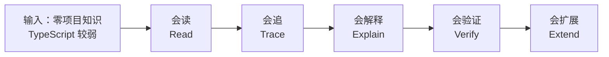
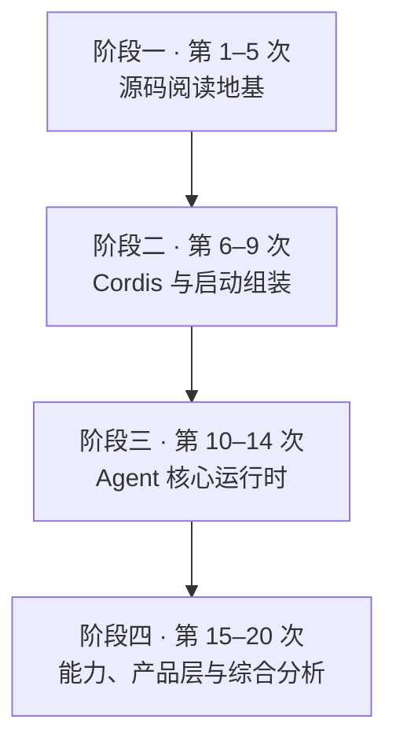
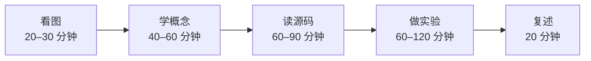
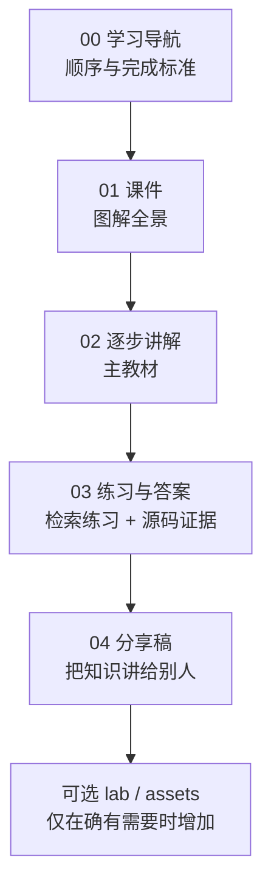
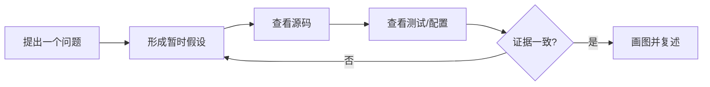

# DeepSeek Harness 源码与原理：20 周学习计划

> 学习资料目录：`D:\code\deepseek-harness\docs`  
> 上游源码目录：`D:\code\deepseek-harness\source\deepseek-harness`  
> 起始源码快照：`cd5ef8148158c3a752a658978873241fdf8e2bbc`（2026-08-28）  
> 适合对象：不了解 DeepSeek Harness、TypeScript 基础较弱的学习者

## 1. 学习目标

这套课程研究的是 DeepSeek Harness 的源码、运行机制与架构选择。产品安装、模型配置和 Web UI 操作不作为主线；只有当一次运行能够验证源码结论时，才把它作为实验手段。

学完后，你应当能够：

1. 用自己的话解释 agent harness 解决什么问题，以及它和模型、IDE、普通应用框架的区别。
2. 读懂项目中常见的 TypeScript 语法，并能从类型、配置和测试反推模块职责。
3. 解释 Cordis 的插件、Context、Service、依赖注入、事件和可逆副作用。
4. 沿源码追踪 `dsh` 启动、一次 agent turn、一次 LLM 请求和一次工具调用。
5. 解释事件日志、投影、持久化、压缩、审批、沙箱和能力 seam 的设计原理。
6. 独立完成一份有源码证据的机制分析，或实现一个小型扩展并说明它为什么放在该扩展点。

## 2. 总体路线

20 次学习分成四个阶段。每个阶段都先建立原理图，再进入源码，不要求一开始逐行理解大型文件。

每次建议用时 3–5 小时，并使用同一个学习闭环。

## 3. 每周学习安排

### 阶段一：源码阅读地基

| 次数 | 主题 | 原理问题 | 主要源码入口 | 学习产物 | 完成标准 |
|---|---|---|---|---|---|
| 第 1 次 | 项目全景与源码阅读地图 | harness 是什么；为什么“一切皆插件”；大型 monorepo 应从哪里读 | `README.md`、`AGENTS.md`、`package.json`、`apps/cli/src/bin.ts` | 项目五层图、入口文件追踪表 | 能在 3 分钟内解释项目目标，并从 CLI 入口找到 profile 启动函数 |
| 第 2 次 | TypeScript 最小语法 I | 类型怎样帮助我们阅读，而不是增加运行时行为 | 小型 `src/index.ts`、`apps/cli/src/args.ts` | 类型注解、interface、联合类型、异步函数图解 | 能读懂函数签名、对象类型、`async/await` 和带判别字段的联合类型 |
| 第 3 次 | TypeScript 最小语法 II | 泛型、声明合并、品牌类型和 ESM 为什么在架构代码中常见 | Cordis 类型声明、事件映射、`tsconfig.base.json` | 语法到架构用途的对照图 | 能解释 `import type`、泛型、`declare module`、`satisfies never` 和 `.ts` 相对导入 |
| 第 4 次 | monorepo、workspace 与构建图 | 254 个 package 如何形成一个可检查的系统 | `pnpm-workspace.yaml`、根脚本、`tsconfig.host.json`、`tsconfig.client.json`、`tsdown.config.ts` | workspace 与构建依赖图 | 能从一个根脚本追到执行文件，并区分源码面、类型产物和运行时产物 |
| 第 5 次 | 怎样读懂一个 package | README、公开入口、实现、测试和调用方如何互相证明 | 选择 `packages/core/session/` 做样本 | 一张 package 阅读卡和一次反向调用搜索 | 能回答模块的职责、输入输出、依赖、生命周期、失败方式和测试证据 |

### 阶段二：Cordis 与启动组装

| 次数 | 主题 | 原理问题 | 主要源码入口 | 学习产物 | 完成标准 |
|---|---|---|---|---|---|
| 第 6 次 | Cordis：Context、Plugin、Fiber 与 effect | 插件如何挂载、卸载，并撤销自己产生的副作用 | `vendor/cordis/src/context.ts`、`fiber.ts`、`service.ts` | 生命周期时序图 | 能解释插件从创建到释放的阶段，以及 disposer 为什么重要 |
| 第 7 次 | Cordis：Service、依赖注入与 scope | 模块为何依赖服务名而不是具体实现；依赖何时激活 | Cordis registry、Harness Service Definition 包 | Service Definition / Provider / Consumer 图 | 能区分接口声明、实现提供方和消费方，并解释 `inject` 的加载作用 |
| 第 8 次 | Cordis：事件与 waterfall | 观察、并行、串行、短路和 around-middleware 有何区别 | `vendor/cordis/src/events.ts`、Harness 事件声明与分发点 | 五种事件模式对照图 | 能判断一个监听器是否必须调用 `next()`，并从声明找到分发与监听代码 |
| 第 9 次 | Loader、配置、profile、bundle 与启动 | 空配置树如何被多层 patch 组装成完整应用 | `apps/cli/src/bin.ts`、`profile-boot.ts`、`packages/boot/`、`packages/bundle/base/cordis.patch.yml` | 从命令行到插件树的启动调用图 | 能说明 profile、bundle、patch 的关系、覆盖顺序和服务依赖激活方式 |

### 阶段三：Agent 核心运行时

| 次数 | 主题 | 原理问题 | 主要源码入口 | 学习产物 | 完成标准 |
|---|---|---|---|---|---|
| 第 10 次 | Session 与事件溯源 | 为什么模型可见信息必须进入追加式事件日志 | `packages/core/session/`、`packages/session/session-projection/` | 事件写入、投影、恢复关系图 | 能区分原始事件、派生消息和 UI 投影，并解释 fork/replay 的基础 |
| 第 11 次 | Agent 抽象、inbox 与生命周期 | 一个活跃 agent 对象拥有什么状态，输入怎样进入它 | `packages/core/agent/`、相关子系统文档与测试 | Agent 状态和输入通道图 | 能定位 agent 的创建、输入、状态变化、取消和结束路径 |
| 第 12 次 | agent loop 状态机 | turn、step、request series 和 continuation 如何驱动循环 | `packages/core/agent-loop/`、`docs/agent-lifecycle.md` | 一次 turn 的源码级时序图 | 能沿源码讲清输入领取、模型请求、工具执行、下一 step 和 turn 结束条件 |
| 第 13 次 | 系统提示词、历史消息与 LLM streaming | 模型请求由哪些插件共同组装；流式结果如何成为持久事件 | `packages/core/system-prompt/`、`packages/llm/llm/`、DeepSeek adapter | 模型请求组装图和流式事件图 | 能指出 prompt section、tool schema、历史投影和 provider adapter 的所有权 |
| 第 14 次 | 工具注册、执行流水线与人工审批 | 模型提出调用后，宿主为什么还需要验证、策略和审批 | `packages/core/tools/`、`packages/interaction/`、`docs/tool-execution-pipeline.md` | pre / execute / post 与审批链图 | 能区分工具 schema、调用参数、实际执行、结果记录和拒绝路径 |

### 阶段四：能力、产品层与综合分析

| 次数 | 主题 | 原理问题 | 主要源码入口 | 学习产物 | 完成标准 |
|---|---|---|---|---|---|
| 第 15 次 | 能力 seam 与执行世界 | 文件、进程、Shell、沙箱、终端和 LSP 如何共享并替换执行后端 | `packages/fs/`、`subprocess/`、`shell/`、`sandbox/`、`terminal/`、`lsp/` | 能力 seam 与 provider 替换影响图 | 能为新执行能力选对 Definition、Provider、Consumer，并说明替换影响范围 |
| 第 16 次 | 长会话：持久化、压缩与上下文 | 原始历史不断增长时，系统如何保存事实并控制模型上下文 | `packages/session/`、`compaction/`、`context/`、`attachment/`、`spill/` | 磁盘、事件、投影、上下文四层图 | 能解释持久化不等于模型上下文，压缩也不应破坏可恢复事实 |
| 第 17 次 | 高阶编排 | subagent、goal、job、workflow、skill 与 hook 分别解决什么问题 | `packages/subagent/`、`goal/`、`jobs/`、`workflow/`、`skill/`、`hooks/` | 六种编排机制的选择树 | 能根据生命周期、持久性和控制权选择机制，而不是把所有后台工作都写进 agent loop |
| 第 18 次 | Typert、API 与 SDK | 类型图如何变成进程外协议，SDK 如何投影核心生命周期 | `packages/typert/`、`api/`、`sdk/`、`python/` | 从 TypeScript 类型到 JSON-RPC 客户端的链路图 | 能定位协议类型、服务器分发、客户端封装和双 SDK 一致性证据 |
| 第 19 次 | Web Host/Client 与测试体系 | 浏览器怎样只消费核心状态；不同测试为什么观察不同层 | `packages/host/`、`client/`、`snapshots/`、Vitest 配置、`docs/testing.md` | UI 数据流图和测试金字塔 | 能为一次核心变更选择单元、快照、Web 或 e2e 证据，并解释原因 |
| 第 20 次 | 综合源码分析与小型扩展 | 如何从一个问题形成可证伪的源码结论，并找到正确扩展点 | 按选题纵向穿过 3–6 个 package | 一份完整机制分析；可选一个最小插件 | 结论有源码、配置和测试三类证据，图能解释数据流、生命周期与失败路径 |

## 4. 每次详细教材的固定结构

每次只生成并学习当前一组材料。这样可以根据上一周的问题调整讲解密度，也能在上游快速变化时重新核对源码。每次学习在 `docs/` 下建立独立的 `第NN次-主题/` 文件夹，固定包含导航、课件、逐步讲解、练习与答案、分享稿五份 Markdown；只有需要可运行代码或独立图片时才增加 `lab/` 或 `assets/`。

五份文件各自只有一个职责。课件负责快速建立图景；逐步讲解负责完整教学；练习与答案负责主动回忆和核验；分享稿负责把所学压缩成可对外表达的结构；导航负责安排顺序，避免读者面对多份材料时不知道从哪一份开始。

图文标准：

- 每个主要概念先放图，再给文字解释。
- 每次至少提供 8 个可渲染的 Mermaid 图、时序图、状态图或源码定位图。
- 图片内容直接写在 Markdown 的 Mermaid 代码块中，避免外部图片链接失效。
- 文字必须完整说明图中省略的前置条件、所有权、失败路径和源码位置。
- 大段源码不复制进教材；只摘本次需要的关键结构，并给出可点击或可搜索的相对路径。

## 5. 学习方法

### 第一遍：只建地图

看标题和所有图，不读源码。目标是知道“有哪些角色、它们怎么连接”，不要追求记住类名和函数名。

### 第二遍：带着问题读源码

每次只追一条窄路径。优先读 `package.json`、README、公开入口、核心实现和对应测试，不从几千行文件的第一行开始漫游。

### 第三遍：用证据复述

每个结论至少写出一个源码路径；重要结论再补配置或测试证据。不能指出证据时，把句子写成问题，不把猜测当成事实。

### 每周保留三个产物

1. 一张自己画的关系图。
2. 一份命令、路径和观察结果记录。
3. 三句话复述：解决的问题、核心机制、最重要的限制。

## 6. 阶段验收

| 阶段 | 闭卷任务 | 开卷源码任务 | 通过标准 |
|---|---|---|---|
| 第 1–5 次 | 画出仓库五层地图和单个 package 的阅读顺序 | 从根脚本找到执行文件、package、实现和测试 | 路径可复现，术语不混淆，能指出至少两类证据 |
| 第 6–9 次 | 画出插件、服务、事件、effect、profile 的关系 | 从 `dsh` 入口追到 base bundle 的任意服务行 | 能解释挂载、激活、短路、卸载和 patch 覆盖 |
| 第 10–14 次 | 画出 user message 到 tool result 的完整 turn | 定位一次请求和一次工具调用的持久事件与实时扩展点 | 不混淆 Session、Agent、LLM 和 Tools 的所有权 |
| 第 15–20 次 | 解释一个跨 package 机制及其失败路径 | 用源码、配置、测试证明分析结论 | 图、文字与证据一致，能说明为何不应直接修改 agent loop |

## 7. 进度记录

每次学完后追加一行。置信度使用 1–5 分；“最大问题”只保留一个最影响下一次学习的问题。

| 次数 | 日期 | 用时 | 学习产物 | 置信度 | 最大问题 |
|---|---|---|---|---|---|
| 第 1 次 |  |  |  |  |  |

## 8. 源码版本变化规则

DeepSeek Harness 仍处于开发者预览阶段。每次教材都必须记录 `git rev-parse HEAD` 的结果，并在写作前重新核对所涉及的函数、文件和测试；旧教材只对其标注的提交负责。

如果某个路径在你学习时不存在：

1. 在源码目录运行 `git log -1 --oneline`，确认当前提交。
2. 用文件名、导出符号或 package 名搜索新位置。
3. 在学习笔记中记录“旧路径 → 新路径”，但不要直接改写旧教材的历史快照。
4. 下一次学习时使用当前源码重新生成路线图。

## 9. 从这里开始

第一组教材：[第 1 次：项目全景与源码阅读地图](../第01次-项目全景与源码阅读地图/00-学习导航.md)。
