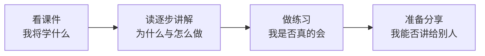

# 第 1 次学习导航：项目全景与源码阅读地图

> 源码快照：`cd5ef8148158c3a752a658978873241fdf8e2bbc`  
> 建议总用时：3–5 小时  
> 本次目标：能解释项目解决的问题，并从 CLI 入口追到 profile 与 base bundle

## 为什么有五份材料

原来的单份 Markdown 同时承担课件、讲义、练习和分享，图很多但教学节奏不够细。现在把不同学习动作分开：先建立地图，再逐步理解，然后主动回忆，最后教给别人。

## 文件与用途

| 顺序 | 文件 | 用途 | 什么时候算完成 |
|---|---|---|---|
| 1 | [01-课件.md](01-课件.md) | 用 12 张图快速建立项目全景 | 能指出 Model、Harness、Agent 和五层源码地图 |
| 2 | [02-逐步讲解.md](02-逐步讲解.md) | 主教材；按问题和源码路径逐步推导 | 能不看答案讲出 `bin → profile → bundle` |
| 3 | [03-练习与答案.md](03-练习与答案.md) | 先做题，再用答案和源码证据校正 | 基础题至少答对 8/10，源码定位题能复现 |
| 4 | [04-分享稿.md](04-分享稿.md) | 准备 10–15 分钟团队分享 | 能在规定时间内讲完，并回答常见问题 |

## 推荐学习顺序

### 第一阶段：建立地图，约 40 分钟

1. 连续看完 `01-课件.md` 中的图，不要一开始就打开所有源码。
2. 在纸上重画“Model + Harness = Agent”。
3. 写下三个最陌生的词，暂时不要搜索旁支。

### 第二阶段：逐步理解，约 90–120 分钟

1. 按顺序阅读 `02-逐步讲解.md`。
2. 遇到“暂停一下”时必须先回答，再继续往下读。
3. 跟随讲解打开三个关键文件：`bin.ts`、`profile-boot.ts`、`cordis.patch.yml`。

### 第三阶段：检验理解，约 60–90 分钟

1. 打开 `03-练习与答案.md`，只做前半部分。
2. 把答案写在自己的笔记中，不直接修改参考答案。
3. 完成后再展开答案，对每一道错题写一句“我原来误解了什么”。

### 第四阶段：准备分享，约 60 分钟

1. 使用 `04-分享稿.md` 进行第一次计时试讲。
2. 删除自己讲不清的次要内容，不通过加快语速塞入更多知识。
3. 至少演练一次两分钟源码定位演示，并准备常见问题回答。

## 两种学习强度

如果本周时间紧，完成“最低路径”：课件、逐步讲解的第 1–7 步、基础自测、分享稿的 8 页结构。预计 2.5–3 小时。

如果时间充足，完成“完整路径”：全部逐步讲解、所有源码定位题、12 分钟试讲、问题清单和个人关系图。预计 4–5 小时。

## 本次学习产物

完成后应保留四样东西：

1. 自己画的 Model / Harness / Agent 关系图。
2. 自己画的五层源码地图。
3. 一份填写完成的 `bin → profile → bundle` 源码追踪记录。
4. 一份经过至少一次计时演练的分享稿。

## 完成检查

- [ ] 我能解释 Model、Harness、Agent 和 agent loop 的区别。
- [ ] 我能解释“一切皆插件”不只指第三方插件。
- [ ] 我能说出五个上游顶层目录的职责。
- [ ] 我能从 `apps/cli/src/bin.ts` 找到 `runProfile()`。
- [ ] 我能说明 base bundle 在启动组装中的作用。
- [ ] 我完成了练习，并在答错的位置写了纠正说明。
- [ ] 我完成了一次 10–15 分钟计时分享。

