# 第 1 次：项目全景与源码阅读地图

> 本次类型：源码与原理入门  
> 建议用时：3–4 小时，可拆成两天  
> 先修知识：会打开文件、会使用 PowerShell；不要求会 TypeScript  
> 源码目录：`D:\code\deepseek-harness\source\deepseek-harness`  
> 本文核对的提交：`cd5ef8148158c3a752a658978873241fdf8e2bbc`（2026-08-28）  
> 配套计划：[DeepSeek Harness 源码与原理：20 周学习计划](../plan/DeepSeek-Harness源码学习计划.md)  
> 本次导航：[第 1 次学习导航](00-学习导航.md)

## 1. 这一次要学会什么

今天不追求运行 DeepSeek Harness，也不深入某个算法。目标是先得到一张可靠地图，知道项目解决什么问题、最重要的架构思想是什么、源码分成哪些层，以及第一次打开仓库时应该沿哪条路径阅读。

学完后，你应该能做到四件事：

1. 区分 model（模型）、harness（智能体运行框架）和 agent（智能体）。
2. 解释 “Everything is a Plugin” 在这个仓库里的实际含义。
3. 说出至少五个顶层目录的职责，并知道哪些目录暂时不要深挖。
4. 从 `apps/cli/src/bin.ts` 追到 profile 组装和 base bundle 配置。

### 图 1：本次学习路线

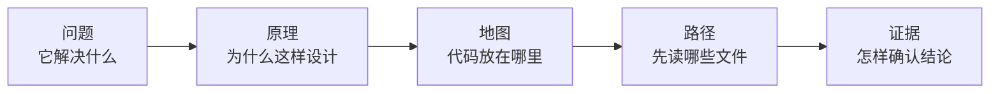

推荐先连续看完本文的 10 张图，再从第 8 节开始动手。第一遍看图时遇到陌生词，不要中断路线；后面的词汇卡和源码实验会解释它们。

## 2. 先理解 Agent = Model + Harness

### 图 2：模型与 Harness 的职责边界

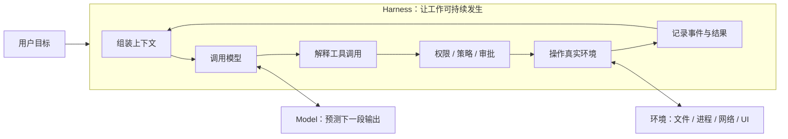

大语言模型接收消息并产生输出。它本身不天然拥有你的文件、不知道一次任务此前发生过什么，也不能安全地直接启动进程。Harness 负责把模型放进一个可持续工作的系统：准备上下文、声明工具、执行和限制动作、记录状态、处理取消与恢复，并把结果送入下一次模型请求。

因此，“换一个更聪明的模型”和“改进 harness”是两类不同工作。前者改变推理能力，后者改变模型能看到什么、能做什么、怎样继续工作，以及发生错误后能否恢复。

### 图 3：三个容易混淆的名词

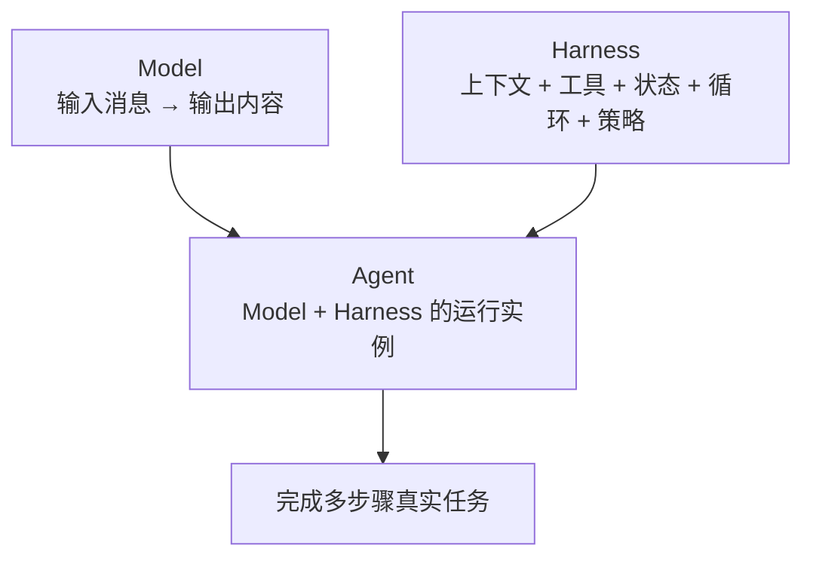

在本课程中：

- **Model** 指 LLM provider 暴露的模型能力。
- **Harness** 指围绕模型的运行时、扩展机制和产品集成。
- **Agent** 指正在处理输入、调用模型与工具、维护生命周期的活动对象。
- **Agent loop** 指驱动一个 agent 从输入走到模型请求、工具结果和下一步的循环实现。

这四个词不能互换。尤其不要把 agent loop 当成整个项目；它只是 Harness 中一个可以替换的插件。

## 3. “Everything is a Plugin” 到底是什么意思

### 图 4：不是在核心外面挂几个插件，而是核心本身由插件组成

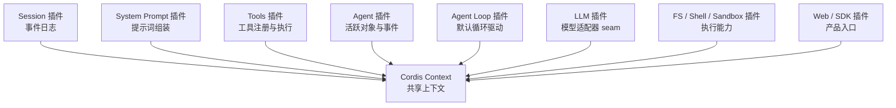

普通软件常有一个不可替换的“核心”，插件只能在外围增加功能。DeepSeek Harness 的设计更彻底：会话日志、模型适配器、工具注册表和 agent loop 自己也通过 Cordis 插件挂载到共享 `Context`。

这里的 plugin 不只是“用户下载的扩展”。只要一个模块由 Cordis 挂载，向 `ctx` 提供服务、注册事件监听器或产生可撤销的 effect，它就在插件架构中。内置模块和第三方模块遵守同一种组合方式。

这个设计带来三个重要结果：

1. 模块通过稳定的服务键或事件合作，消费方不必导入具体实现。
2. 配置可以替换 provider 或插入新插件，不必直接修改 agent loop。
3. 插件卸载时，它注册的服务、监听器和其他 effect 可以按生命周期撤销。

> 暂时只记住：`Context` 像一个由 Cordis 管理的“能力集合”，plugin 向其中贡献能力。第 6–8 次会分别学习生命周期、服务依赖和事件语义。

## 4. 用五层地图认识源码

当前快照的 `packages/` 下有 51 个一级分组和 254 个 `package.json`。这不是一个适合从第一行顺序读到最后一行的项目；正确方法是先把文件放回职责层，再沿一条调用链纵向阅读。

### 图 5：学习用的五层源码地图

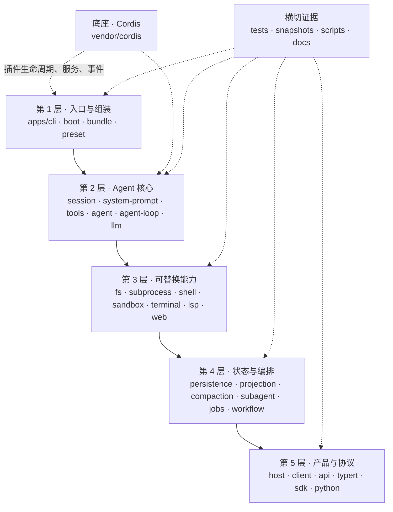

这五层是为了学习而画的职责地图，不是仓库声明的正式分层，也不表示只能从上到下调用。真实依赖由 package manifest、TypeScript import、Cordis service injection、事件和配置共同表达。

### 顶层目录词汇卡

| 目录 | 现在只需要知道什么 | 第一次阅读策略 |
|---|---|---|
| `apps/` | 产品级可执行入口；当前关键入口是 `apps/cli` | 先读 `src/bin.ts`，不要先读所有参数与插件管理细节 |
| `packages/` | DeepSeek Harness 自己的功能 package，按领域分组 | 按问题选一个 group，不做全量目录遍历 |
| `vendor/` | 仓库固定的 Cordis 及基础库源码 | 先把它当框架底座，第 6 次再进入实现 |
| `scripts/` | 构建、生成器和大量仓库规则的可执行实现 | 当根 `package.json` 的脚本指向它时再读 |
| `snapshots/` | 通过记录会话与 UI 结果验证真实组合行为 | 先知道它是端到端证据，第 19 次系统学习 |
| `docs/` | 上游项目自己的架构、子系统、开发与用户文档 | 把它当源码导航和概念索引，不把它和本学习工作区的 `docs/` 混在一起 |
| `python/` | Python SDK 与随附运行时 | 第 18 次与 TypeScript SDK 一起读 |
| `native/` | 与平台约束有关的原生组件 | 初学阶段跳过，除非分析 sandbox 或进程边界 |
| `website/` | 上游文档网站的投影与展示配置 | 不属于核心运行时，当前跳过 |

## 5. 核心 package 不是按“页面功能”划分的

项目最重要的源码入口集中在 `packages/core/` 和 `packages/llm/`。它们按运行时职责划分，而不是按某个 UI 页面划分。

### 图 6：一次智能体工作所依赖的六个核心角色

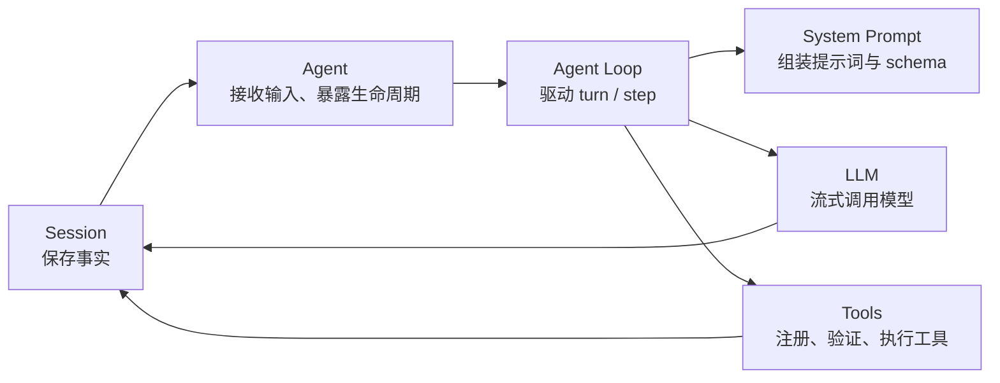

六个角色的第一印象如下：

| 角色 | 主要路径 | 它拥有的核心问题 |
|---|---|---|
| Session | `packages/core/session/` | 哪些事实需要记录；怎样追加和广播事件 |
| System Prompt | `packages/core/system-prompt/` | 这一次模型请求有哪些提示词片段和工具 schema |
| Tools | `packages/core/tools/` | 有哪些工具；调用怎样经过检查和执行 |
| Agent | `packages/core/agent/` | 活跃 agent 的接口、注册表、输入和生命周期事件 |
| Agent Loop | `packages/core/agent-loop/` | 怎样把输入推进为 step、模型请求、工具结果和下一步 |
| LLM | `packages/llm/llm/` | 消息、流式响应与可替换 adapter 的共同接口 |

现在不要打开六个目录逐行阅读。先知道问题的所有者，后续遇到某个行为时才能去正确位置找证据。

## 6. 第一条源码调用链：从 CLI 到插件树

### 图 7：`dsh` 启动的第一条窄路径

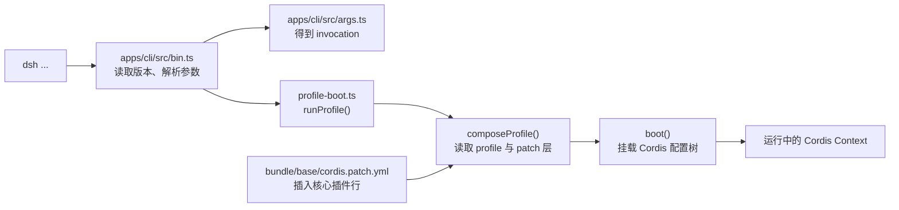

第一站是 [`apps/cli/src/bin.ts`](https://github.com/deepseek-ai/deepseek-harness/blob/cd5ef8148158c3a752a658978873241fdf8e2bbc/apps/cli/src/bin.ts)。它只有一个明确职责：把进程参数解析为一种 invocation，然后分派到 profile 启动、插件管理或配置打印。

下面是本次需要看懂的最小结构。语法细节会在第 2 次讲；今天只观察名字和控制流。

```ts
const invocation = parseDshArgs(process.argv.slice(2), readVersion())

switch (invocation.mode) {
  case 'profile': {
    const { runProfile } = await import('./profile-boot.ts')
    await runProfile({
      environment: loadLayeredEnv('dsh'),
      profile: invocation.profile,
      patchFiles: invocation.patches,
      args: invocation.args,
    })
    break
  }
}
```

先把它翻译成自然语言：读取命令行参数；如果这次 invocation 是启动 profile，就按需加载 `profile-boot.ts`；把环境、profile 名、patch 文件和剩余参数交给 `runProfile()`。

第二站是 [`apps/cli/src/profile-boot.ts`](https://github.com/deepseek-ai/deepseek-harness/blob/cd5ef8148158c3a752a658978873241fdf8e2bbc/apps/cli/src/profile-boot.ts)。当前快照中：

- `composeProfile()` 从第 156 行开始，负责整理 profile 与多层 patch。
- `runProfile()` 从第 209 行开始，负责端到端启动。
- 第 251 行调用 `boot(...)`，把组合后的 patch 应用到空根配置并得到 Cordis Context。

第三站是 [`packages/bundle/base/cordis.patch.yml`](https://github.com/deepseek-ai/deepseek-harness/blob/cd5ef8148158c3a752a658978873241fdf8e2bbc/packages/bundle/base/cordis.patch.yml)。它不是 TypeScript 算法，而是一份组合清单：当前快照中 `llm`、`session`、`agent`、`tools`、`system-prompt`、`agent-loop` 等核心行都由这份 base bundle 插入。

这条调用链第一次揭示了项目的关键原理：**应用不是在 `main()` 中手写创建所有组件，而是由 CLI 选择 profile，再用 bundle 与 patch 组合一棵 Cordis 插件树。**

## 7. 第一次看到 TypeScript 时只认这些路标

### 图 8：源码阅读路标，不是完整语法课

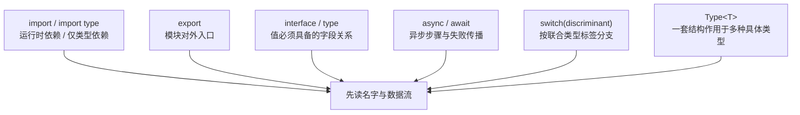

今天遇到类型注解时，不需要停下来背语法。使用下面四个问题即可：

1. 这个文件从哪里导入能力？
2. 它向外导出了什么名字？
3. 哪个字段决定了控制流分支？
4. 哪个函数把数据交给了下一个模块？

例如 `invocation.mode` 是分支标签，`runProfile` 是交给下一模块的入口，而 `RunProfileOptions` 只是描述参数应有哪些字段。类型帮助你导航，但类型声明本身不会自动创建服务或执行逻辑。

## 8. 大型仓库的正确阅读单位：一个问题，不是一个目录

### 图 9：阅读一个机制时的证据三角

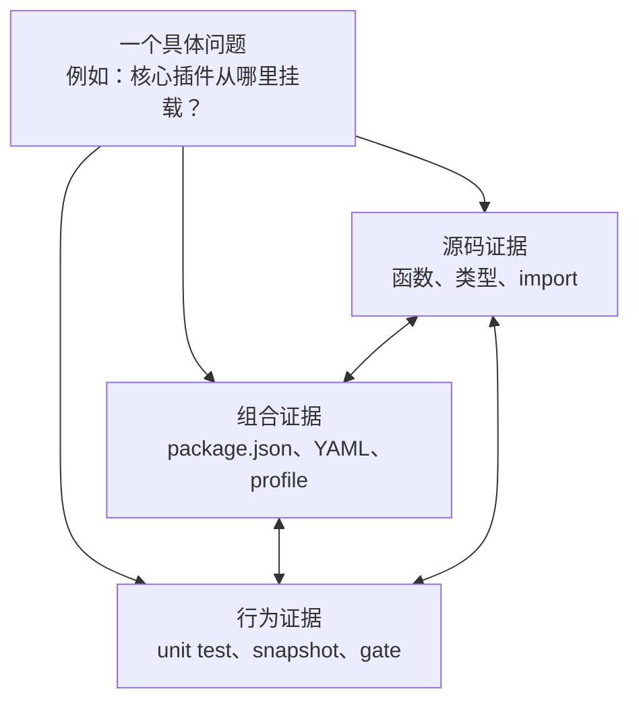

只看实现文件容易漏掉“这个实现是否真的被组合进产品”；只看 YAML 又不知道运行语义；只看测试可能把测试装配误认为生产装配。可靠结论至少要知道三类证据在哪里，重要结论尽量让其中两类互相印证。

### 图 10：阅读单个 package 的固定顺序

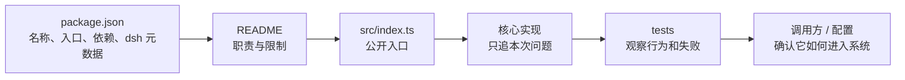

这个顺序比“打开 `src` 后逐文件浏览”更有效。`package.json` 告诉你模块身份和依赖；README 提供作者希望维护的职责；公开入口限制对外面；测试展示行为；调用方或配置证明它是否进入真实组合。

## 9. 动手实验：亲自完成第一条源码追踪

本实验不需要 API 密钥，不启动 Web UI，也不要求构建项目。所有命令只读取源码。

### 步骤 1：进入隔离的上游源码目录

在 PowerShell 中从学习工作区根目录运行：

```powershell
Set-Location .\source\deepseek-harness
git log -1 --oneline
```

本文快照的输出开头应为：

```text
cd5ef81 Merge pull request #3248 from deepseek-harness/release/dsh-0.1.2-alpha.1
```

如果你的提交不同，不代表操作失败；把实际提交记到学习笔记中，后续以你的源码为准。

### 步骤 2：确认项目身份和规模

```powershell
Get-Content .\package.json -TotalCount 18
(Get-ChildItem .\packages -Directory).Count
(Get-ChildItem .\packages -Recurse -File -Filter package.json).Count
```

在本文快照中，你会看到根 package 名 `@deepseek-ai/dsh-root`、版本 `0.1.2-alpha.1`、ESM 标记 `"type": "module"`，以及 51 个 package 分组和 254 个 `packages/**/package.json`。这些数字只用于感受仓库规模，不是需要背诵的架构常量。

### 步骤 3：观察 CLI 如何分派

```powershell
Get-Content .\apps\cli\src\bin.ts
Select-String -Path .\apps\cli\src\bin.ts -Pattern 'parseDshArgs','runProfile','runPlugin','runDumpConfig'
```

请在笔记中回答：

1. 参数解析发生在哪个文件？
2. 哪一种 `invocation.mode` 会进入 `runProfile()`？
3. 为什么 `runProfile` 使用动态 `import()`，本次只需要观察什么，不需要猜测什么？

第 3 问的正确学习姿势是：现在只能确认它是按需导入；除非继续查看设计说明、测试或构建结果，不要自行断言作者这样写是为了性能、循环依赖或兼容性。

### 步骤 4：从 `runProfile` 找到真正的组装点

```powershell
Select-String -Path .\apps\cli\src\profile-boot.ts -Pattern '^async function composeProfile','^export async function runProfile','await boot','allPatches'
```

把观察结果写成箭头：

```text
runProfile
  → composeProfile
  → allPatches
  → boot
  → Cordis Context
```

这只是函数级概览。今天不进入 `boot()` 内部，因为那会提前引入 Context、Loader、Fiber 和 effect；它们有独立课程。

### 步骤 5：确认核心能力来自配置组合

```powershell
Select-String -Path .\packages\bundle\base\cordis.patch.yml -Pattern 'id: llm$','id: session$','id: agent$','id: tools$','id: system-prompt$','id: agent-loop$'
```

在本文快照中会找到六个 id。请注意：YAML 中出现一行并不等于插件已经可用；它还需要 Loader 解析、模块解析成功、依赖满足并完成挂载。今天的结论只到“base bundle 声明插入这些核心插件行”为止。

### 步骤 6：保存你的第一份追踪结果

在个人笔记中复制下面的模板并填写：

```markdown
## 第 1 次源码追踪

- 源码提交：
- 问题：核心插件怎样进入运行中的应用？
- CLI 入口：
- profile 启动函数：
- 组合函数：
- base bundle：
- 我已确认的结论：
- 我还没有证据的猜想：
```

## 10. 把调用链放回完整运行图

你现在只追了启动链，还没有追 agent loop。为了给后续课程留一个“空位”，先看下面的完整关系图。

### 图 11：启动完成后，一次任务的大致位置

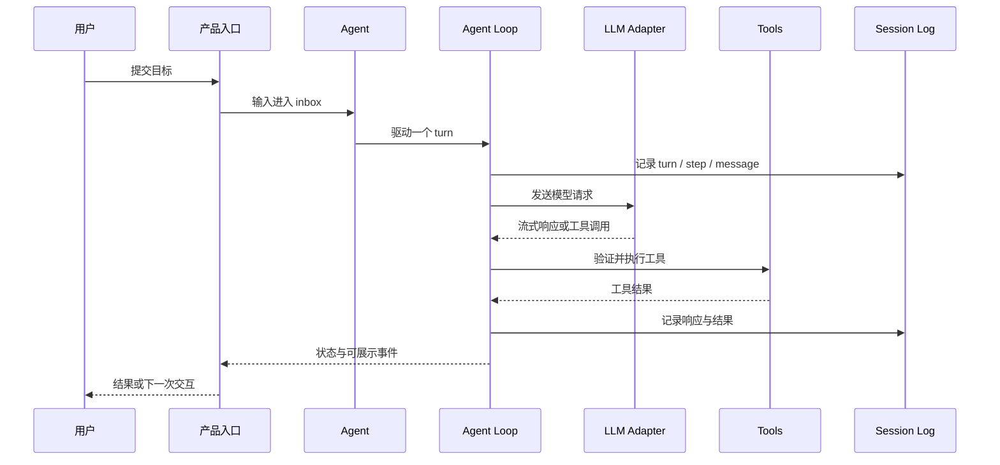

这张图刻意省略了 prompt assembly、权限审批、上下文压缩、provider 选择和各种实时事件。它是后续课程要逐步填充的骨架，不是完整实现说明。

## 11. 常见误区

### 误区 1：先读 agent loop 就能理解整个项目

agent loop 依赖 Session、System Prompt、LLM 和 Tools 的服务及事件语义。没有前置地图时直接读循环，会把大量“调用别人的职责”误认为循环自己的逻辑。

### 误区 2：一个目录就是一个完整功能

DeepSeek Harness 使用许多小 package 表达 Service Definition、Provider 和 Consumer。一个能力经常跨多个 package；目录名只是入口，配置与依赖才说明它们怎样组合。

### 误区 3：`cordis.patch.yml` 的行顺序就是启动顺序

base bundle 源码注释明确说明，行顺序不携带加载语义；服务依赖的可用性驱动激活。不要把 YAML 的阅读顺序画成确定的运行时装载顺序。

### 误区 4：看见类型就认为运行时做了校验

TypeScript 类型在编译后通常消失。项目只在配置、JSON、持久化、进程或 wire 等边界进行必要的运行时验证；以后遇到 `interface` 时要继续寻找真实解析或校验代码。

### 误区 5：上游 `docs/` 就是我们的学习资料目录

不是。`source/deepseek-harness/docs/` 属于上游源码快照；`D:\code\deepseek-harness\docs\` 才是这套私人学习资料。更新上游源码时，不应覆盖学习计划和笔记。

## 12. 自测题

先不看答案，用自己的话回答。

1. Model 和 Harness 的职责分别是什么？
2. 为什么说 agent loop 不是整个 Harness？
3. “Everything is a Plugin” 是否只指第三方扩展？
4. Cordis Context 在当前心智模型中起什么作用？
5. `apps/cli/src/bin.ts` 的主要职责是什么？
6. profile 启动代码从哪里获得核心插件清单？
7. 为什么不能仅凭 YAML 行顺序推断服务启动顺序？
8. 阅读一个 package 时，为什么要查看调用方或配置？
9. 源码、配置和测试三类证据分别回答什么问题？
10. 当前阶段为什么不直接深入 `boot()` 和 agent loop？

<details>
<summary>展开参考答案</summary>

1. Model 根据输入生成内容；Harness 负责上下文、工具、状态、循环、权限和环境集成。
2. agent loop 只负责驱动运行步骤，它依赖其他插件提供的 Session、System Prompt、LLM 和 Tools 等能力，而且自身也可替换。
3. 不是。内置核心模块同样作为 Cordis 插件被组合。
4. Context 是插件共享和发现服务、事件与生命周期资源的受管理上下文。
5. 读取版本、解析进程参数，并按 invocation mode 分派到 profile、plugin 或 dump-config 路径。
6. `profile-boot.ts` 组合 profile、bundle 与 patch；base-backed profile 的核心行来自 `packages/bundle/base/cordis.patch.yml` 等层。
7. 配置注释说明激活由服务可用性驱动，行顺序主要服务于阅读。
8. 它能证明 package 怎样进入真实组合，以及哪个模块实际依赖其公开能力。
9. 源码解释实现，配置解释组装，测试解释可观察行为与失败。
10. 这些实现依赖 Cordis 生命周期、服务、事件和 Agent 核心概念；先建立先修模型能减少误读。

</details>

## 13. 本次必须交付的学习产物

### 图 12：完成检查

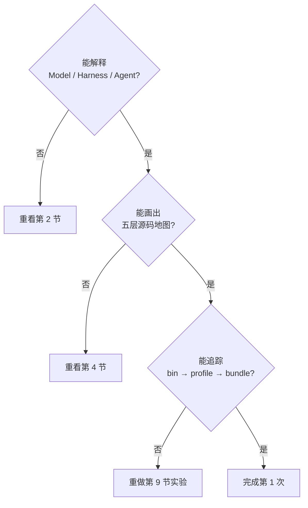

完成本次学习前，请保存：

1. 一张你自己重画的“Model + Harness = Agent”图。
2. 一张五层源码地图，每层至少写两个实际路径。
3. 第 9 节的源码追踪记录，明确区分“已确认结论”和“尚无证据的猜想”。
4. 不看本文，用三句话解释这个项目：解决的问题、核心架构思想、第一次阅读入口。

三句话参考格式：

> DeepSeek Harness 把模型接入上下文、工具、状态和真实环境，使 agent 能持续完成多步骤任务。它基于 Cordis 把会话、模型、工具和 agent loop 等核心能力都作为可组合、可卸载的插件。第一次读源码应从 CLI 与 profile 组装建立地图，再按具体问题进入核心 package，而不是顺序遍历整个 monorepo。

## 14. 下一次预习

第 2 次学习“为读懂本项目准备的 TypeScript 最小语法 I”。预习只做一件事：重新打开 `apps/cli/src/bin.ts`，把看不懂的符号圈出来，不要提前搜索答案。

下一次会用这个文件讲清：

- `import` 与 `import type`；
- 类型注解和对象类型；
- 带标签的联合类型与 `switch`；
- `async`、`await` 和动态 `import()`；
- `never` 如何帮助编译器检查漏掉的分支。
