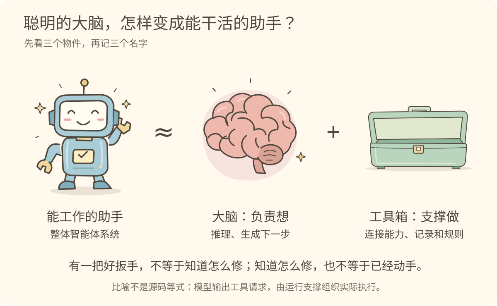
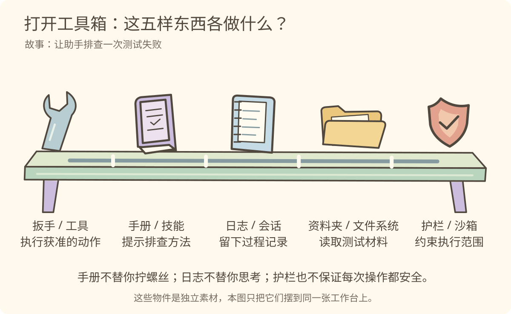
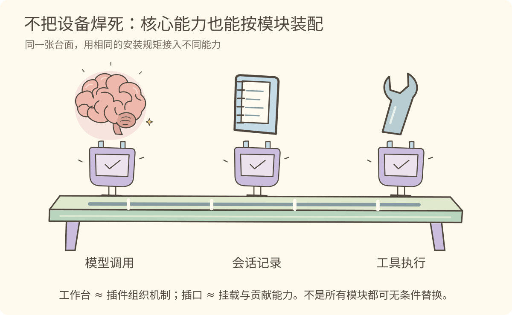
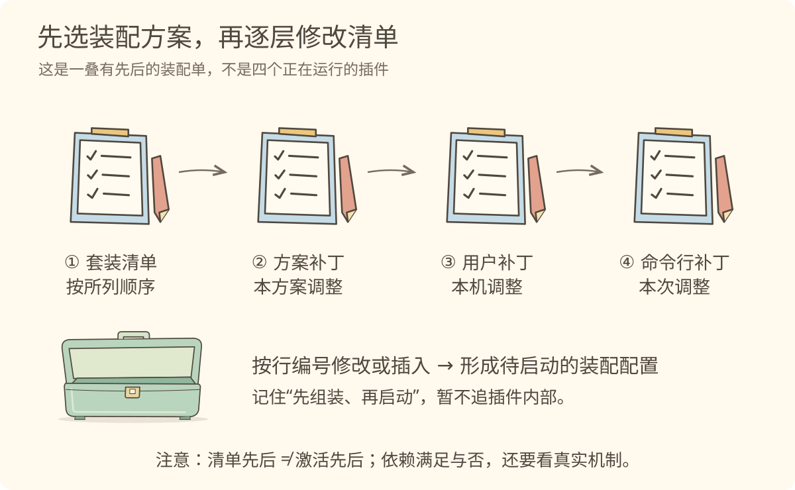
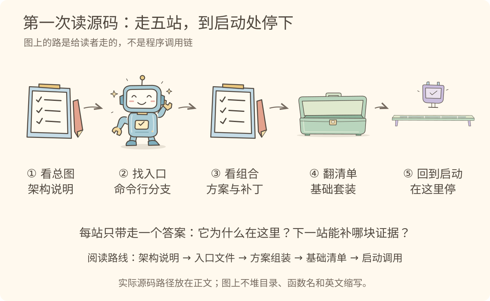
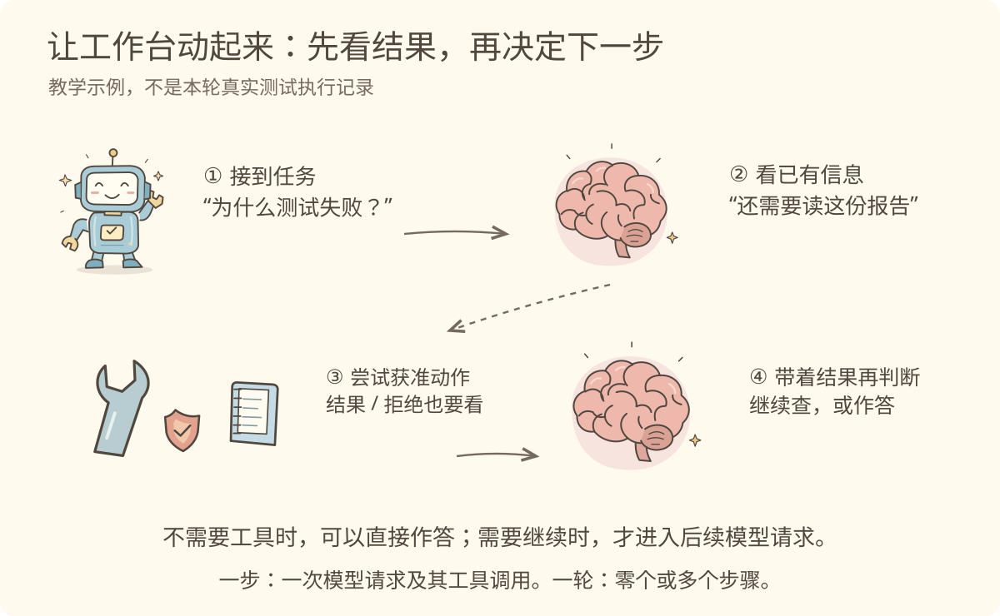

# 第一讲 · 一颗大脑，还缺什么？

> 源码快照：`cd5ef8148158c3a752a658978873241fdf8e2bbc`。比喻帮助理解，结论以该快照的源码与维护文档为准。

## 1. 它说得对，但它动过手吗？

你发来一句：“测试失败了，帮我看看。”如果只把这句话交给模型，它能推理和生成建议，却不能仅凭这句话知道磁盘上的实际报告。

模型（Model）先想成一颗大脑；运行支撑系统（Harness）先想成它的工具箱和整套工作安排。两者配合，才形成我们平常说的“能做事的助手”。

> 图 1：会想与能做不是一回事。这里的助手指整体智能体系统，不是源码 Agent 类型的定义；工具箱也不只有工具。

先暂停三秒：**图中如果只剩下大脑，哪件事不能据此声称已经发生？** 答：真实读文件或运行测试。分析文字不等于执行证据。

回到源码：模型调用、工具、会话和循环由不同包承担职责。[模型调用包](https://github.com/deepseek-ai/deepseek-harness/blob/cd5ef8148158c3a752a658978873241fdf8e2bbc/packages/llm/llm/README.md)；[核心架构](https://github.com/deepseek-ai/deepseek-harness/blob/cd5ef8148158c3a752a658978873241fdf8e2bbc/docs/architecture.md#core-packages)。

## 2. 排查时，到底拿哪件东西？

我们打开箱子，不先背五个英文名。想象你真的走进工作间：材料在资料夹里，步骤在手册里，动作靠扳手，过程记在日志上，危险动作受护栏约束。

> 图 2：先分清“做、教、记、读、约束”，再记名字。并排是职责对照，不是运行顺序；护栏不意味着绝对安全。

工具（Tool）是可调用的动作；技能（Skill）是可复用的任务指令；会话（Session）保存追加的事件记录；文件系统（Filesystem）提供访问文件材料的能力；沙箱（Sandbox）在本项目中主要约束子进程的文件影响范围。

**小测：给助手一本“测试排查手册”，它就能跑测试了吗？** 不能。还需要相应工具、执行环境和允许执行的条件。

证据：[工具](https://github.com/deepseek-ai/deepseek-harness/blob/cd5ef8148158c3a752a658978873241fdf8e2bbc/packages/core/tools/README.md)、[技能](https://github.com/deepseek-ai/deepseek-harness/blob/cd5ef8148158c3a752a658978873241fdf8e2bbc/packages/skill/README.md)、[会话](https://github.com/deepseek-ai/deepseek-harness/blob/cd5ef8148158c3a752a658978873241fdf8e2bbc/packages/core/session/README.md)、[文件能力](https://github.com/deepseek-ai/deepseek-harness/blob/cd5ef8148158c3a752a658978873241fdf8e2bbc/packages/fs/README.md)、[沙箱](https://github.com/deepseek-ai/deepseek-harness/blob/cd5ef8148158c3a752a658978873241fdf8e2bbc/packages/sandbox/README.md)。

## 3. 为什么不把所有设备焊在一张台子上？

想加一个新模型、换一种日志保存方式，就去修改同一个巨大主函数，会让变化彼此牵连。这里的直觉不是“插件很多”，而是“能力之间留有装配边界”。

插件（Plugin）像可安装的模块。Cordis 是管理这些模块的框架：让它们贡献服务、声明依赖、参与事件与回收副作用。先把它想成工作台的安装规矩，不把它想成另一个模型。

> 图 3：核心能力也用插件装配，不只是外围扩展才叫插件。接口、依赖和生命周期仍需匹配，不能理解成随便拔插。

回到源码：[架构说明](https://github.com/deepseek-ai/deepseek-harness/blob/cd5ef8148158c3a752a658978873241fdf8e2bbc/docs/architecture.md#cordis) 明确把模型适配器、工具注册、会话日志和循环列为插件；[Cordis 入门](https://github.com/deepseek-ai/deepseek-harness/blob/cd5ef8148158c3a752a658978873241fdf8e2bbc/docs/cordis-primer.md#cordis-in-five-ideas) 解释它们如何协作。

## 4. 同一套零件，怎么装成不同工作室？

装配方案（Profile）决定采用哪些套装和调整；套装（Bundle）带来一组插件配置与代码；补丁（Patch）按规则调整配置。

> 图 4：这是配置应用顺序，不是插件激活顺序。实际 overlays 还包含启动代码合成的调整；图中只突出常见的命令行补丁入口。

不用猜框架机制，先读 [allPatches()](https://github.com/deepseek-ai/deepseek-harness/blob/cd5ef8148158c3a752a658978873241fdf8e2bbc/apps/cli/src/profile-boot.ts#L136)。四组展开顺序就是眼前这叠清单的源码依据。具体插件能否激活，还要看依赖等条件。

## 5. 第一次打开仓库，去哪里？

> 图 5：我们去翻配置，再回到调用处；配置文件不是被函数“调用”的一站。

准确文件和要找的符号在 [逐步讲解](02-逐步讲解.md) 的“五站源码小旅行”。第一讲在 boot() 停下，把“怎么组起来”看清后，再学“怎么跑起来”。

## 6. 接到任务之后，不是一路直冲到底

> 图 6：动作结果回来以后，才有新的证据。需要工具只是一个可能分支，工具可能被拒绝，模型也可能直接回答。

一步（Step）是一次模型请求及其工具调用；一轮（Turn）可以有零个或多个步骤。接收输入不应被画成某一步内部的模型调用。参见 [运行过程](https://github.com/deepseek-ai/deepseek-harness/blob/cd5ef8148158c3a752a658978873241fdf8e2bbc/docs/architecture.md#turn-flow)。

合上这一页，试着说一句：**大脑想，支撑系统组织做；日志留下证据，结果决定后续。**
