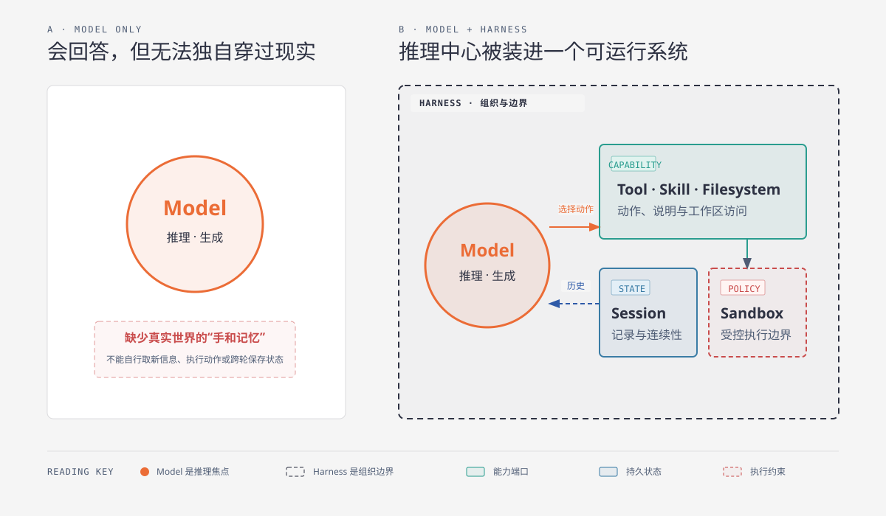
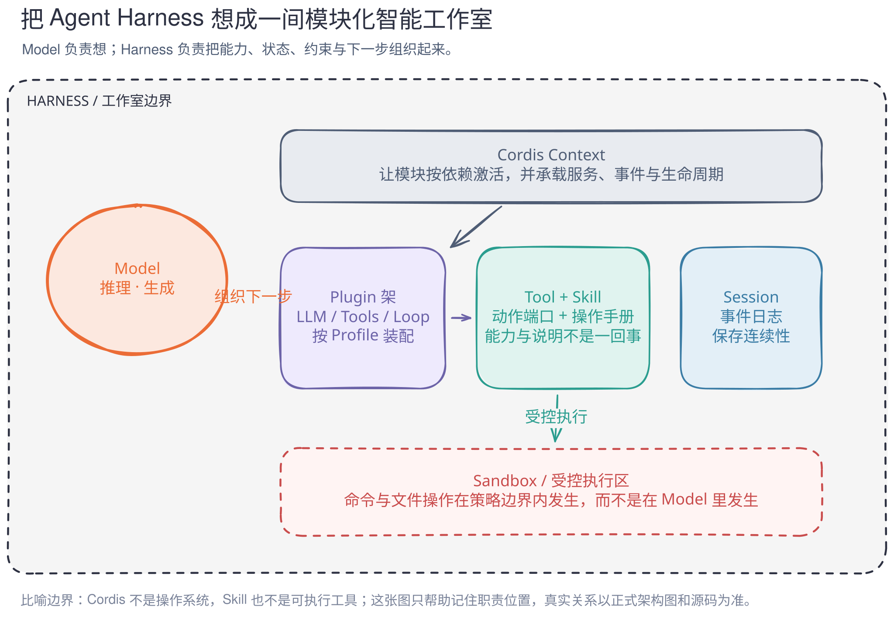
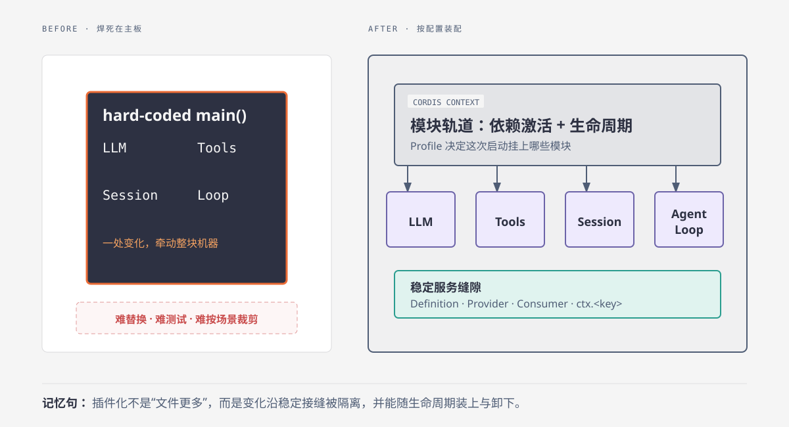
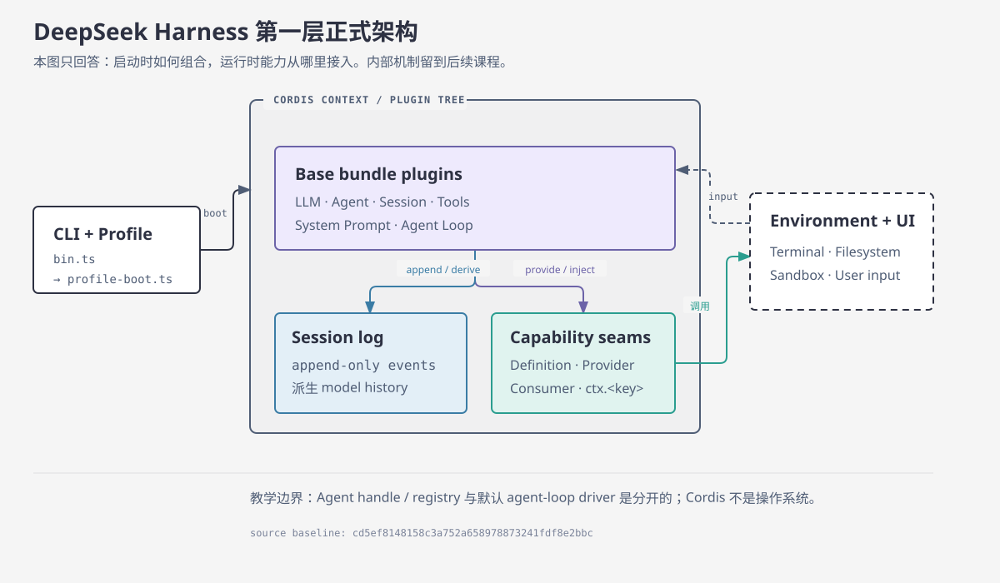
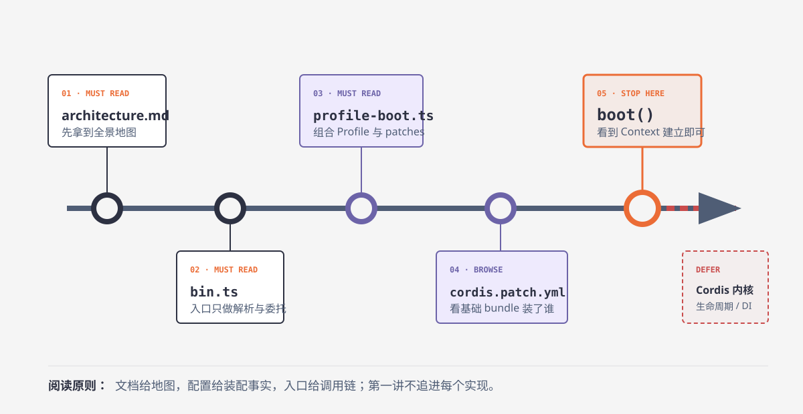
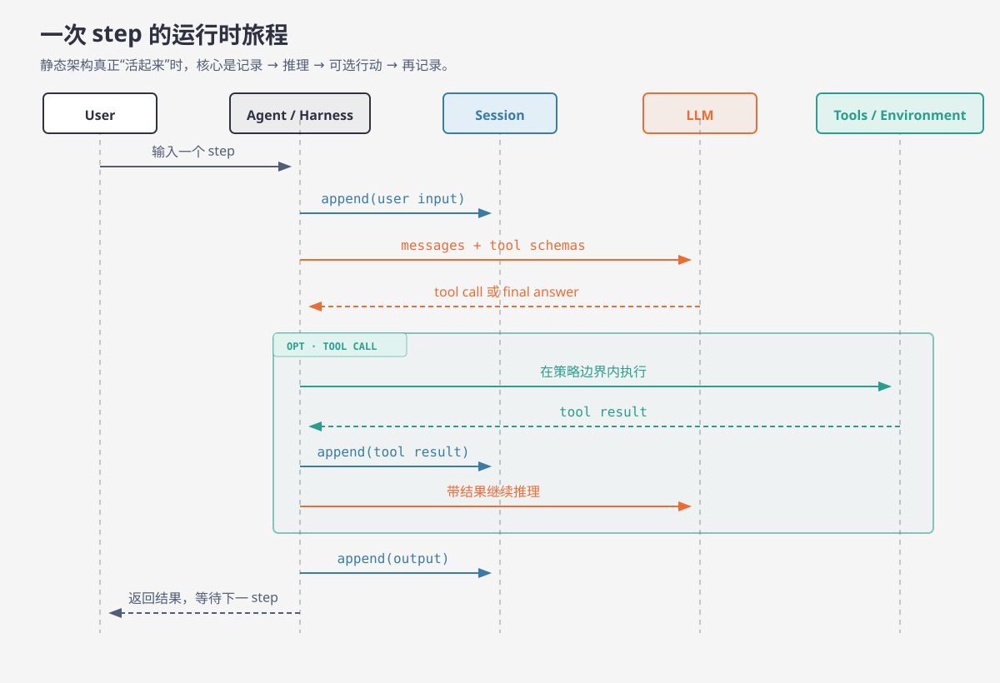

# 第 01 次逐步讲解：从一颗聪明的大脑，到一套能持续工作的系统

> 源码基准：[`cd5ef8148158c3a752a658978873241fdf8e2bbc`](https://github.com/deepseek-ai/deepseek-harness/tree/cd5ef8148158c3a752a658978873241fdf8e2bbc)
> 阅读约定：文中明确区分 **源码事实**、**教学近似** 与 **比喻**。

## 1. 先体验缺口：聪明不等于能完成任务

想象一位非常聪明、但被关在玻璃房里的人。他能理解你的问题，也能给出周密方案，却没有门、工具柜、工作日志和安全规则。

你让他“检查仓库并修复问题”，他可以推理“应该搜索入口、修改文件、运行测试”，但仅靠推理不能让这些动作在真实机器上发生。

这正是 Model 与 Harness 的第一层差异：



> 图 01-01：Model 提供推理与生成；Harness 把模型接入能力、状态与执行边界。

### 1.1 源码事实

DeepSeek Harness 把职责分散在不同 package：

- [`dsh-llm`](https://github.com/deepseek-ai/deepseek-harness/tree/cd5ef8148158c3a752a658978873241fdf8e2bbc/packages/llm/llm) 提供 provider-neutral model-call service。
- [`dsh-tools`](https://github.com/deepseek-ai/deepseek-harness/tree/cd5ef8148158c3a752a658978873241fdf8e2bbc/packages/core/tools) 拥有模型可见工具注册与 guarded execution pipeline。
- [`dsh-session`](https://github.com/deepseek-ai/deepseek-harness/tree/cd5ef8148158c3a752a658978873241fdf8e2bbc/packages/core/session) 拥有 append-only 事件日志与派生历史。
- [`dsh-sandbox`](https://github.com/deepseek-ai/deepseek-harness/tree/cd5ef8148158c3a752a658978873241fdf8e2bbc/packages/sandbox) 负责受策略约束的进程执行。

因此，“Model 不直接拥有 Filesystem、Session 或 Sandbox”不是审美偏好，而是 package 职责分离带来的事实。

### 1.2 教学近似

> Agentic System ≈ Model + Harness

这句话只帮助建立开场直觉。源码中的 `Agent` 不是这个等式：[`dsh-agent`](https://github.com/deepseek-ai/deepseek-harness/tree/cd5ef8148158c3a752a658978873241fdf8e2bbc/packages/core/agent) 拥有 Agent handle、live registry 与 `agent/*` 事件；默认创建和驱动由 `dsh-agent-loop` 提供。

如果把近似当成源码定义，后面阅读 `Agent` 接口时一定会困惑。

## 2. 先建立空间，再学习名词

抽象名词最难记，是因为它们在脑中没有位置。现在进入一间“模块化智能工作室”。



> 图 01-02：比喻只负责建立职责位置；真实机制仍要回到 Context、Plugin、Service 和配置。

### 2.1 映射

#### Model：推理工作台

它读到模型可见的 messages 与 tool schemas，产生文本或 tool call。它不是工作室本身。

#### Harness：整套工作安排

Harness 不是单个 class 的名字，而是把上下文、能力、策略、状态和继续执行组织起来的系统性角色。

#### Cordis：模块轨道与能力登记

Cordis 的 primer 把核心概括为 Plugin、Context、`inject`、typed events 与 reversible effects。Plugin 向共享 Context 贡献能力；依赖未满足时，可通过 `inject` 等待 service 出现。

和 Spring 的相似点是：两者都帮助组织依赖、生命周期和扩展。不同点是：Cordis 的 Context/Fiber/Service/effect 有自己的语义，不能直接翻译成 `ApplicationContext`、Bean 与 `@EventListener`。

#### Tool 与 Skill：设备和说明书

- Tool 是模型可见的动作定义及受保护的执行路径。
- Skill 是 provider 提供、registry 合并、consumer 公开并通过 loader tool 加载的可复用指令。

所以 Skill 可以告诉模型“怎样系统化审查 Spring Boot 项目”，但真正读取文件、运行命令仍依赖 Tool 与环境能力。

#### Session：工作日志

Session 的重点是 append-only event log。模型历史从日志派生，持久化由独立实现提供。把它理解成聊天消息数组，会看不到 tool result、状态变化和恢复语义。

#### Sandbox：受控执行区

Sandbox 对 subprocess 施加策略边界。它不天然等于 Docker、microVM 或远程执行器，也不等于“工作目录”这个普通路径概念。

### 2.2 比喻边界

比喻会偷偷引入不存在的事实。例如“轨道”容易让人以为插件按物理顺序启动，“设备”容易让人以为 Tool 一定执行成功。正式结论只能来自源码、配置和维护文档。

## 3. 为什么核心也要插件化

如果把 LLM、Tools、Session、Agent Loop 全部写进主函数，系统看起来更短，却把变化源焊在一起。



> 图 01-03：插件化的价值是隔离变化和组合生命周期，不是追求更多文件。

### 3.1 上游架构给出的关键事实

[`docs/architecture.md`](https://github.com/deepseek-ai/deepseek-harness/blob/cd5ef8148158c3a752a658978873241fdf8e2bbc/docs/architecture.md) 明确说明：model adapter、tool registry、session log、agent loop 本身都是插件；运行中的 `dsh` 是在 boot 时组成的 plugin tree。

这意味着“Plugin”不只指用户后来安装的扩展。核心能力本身也遵循同一组合模型。

### 3.2 稳定接缝是什么

完整 capability seam 包括：

| 角色 | 直觉 | 本讲只记什么 |
|---|---|---|
| Definition | 定义稳定服务键和词汇 | 消费方认 `ctx.<key>` |
| Provider | 提供具体实现 | 可以替换，但要满足契约 |
| Consumer | 注入并使用能力 | 不直接依赖某个实现文件 |

Service Definition 不是“一个 TypeScript interface”这么简单。它还拥有稳定 key 与词汇。完整实现留到后续课程。

### 3.3 可替换不等于随便替换

插件化只提供结构上的替换点。真实替换仍受契约、依赖、配置、生命周期和行为兼容约束。不要从“都是插件”推出“任意模块可以无成本互换”。

## 4. 从工作室回到正式架构



> 图 01-04：CLI/Profile 决定如何组成 Cordis plugin tree；运行时通过稳定能力接缝与日志连接外部世界。

现在逐一把比喻还原：

1. **工作室方案** → Profile、bundle 与 patch stack。
2. **模块轨道** → Cordis Context 和 plugin tree。
3. **可插模块** → base bundle 中的 LLM、Agent、Session、Tools、System Prompt、Agent Loop 等 entry。
4. **能力插座** → Definition / Provider / Consumer 与 `ctx.<key>`。
5. **工作日志** → append-only Session events 与 derived model history。
6. **外部设备** → Terminal、Filesystem、Sandbox、UI 等 provider/consumer 组合。

注意，图中箭头有明确语义：`boot` 表示配置组合进入 Context，`provide/inject` 表示服务接缝，`append/derive` 表示日志关系，`调用` 表示通过能力接入外部环境。箭头不是装饰。

## 5. 进入源码：第一站是入口，不是核心算法



> 图 01-05：第一次阅读的任务是找到装配链，而不是证明自己能钻进最深的实现。

### 5.1 为什么现在看 `bin.ts`

我们要确认 CLI 把 profile 模式委托给谁。

```ts
const invocation = parseDshArgs(process.argv.slice(2), readVersion())

switch (invocation.mode) {
  case 'profile': {
    const { runProfile } = await import('./profile-boot.ts')
    await runProfile({
      environment: loadLayeredEnv('dsh'),
      profile: invocation.profile,
      patchFiles: invocation.patches,
      args: invocation.args,
    })
    break
  }
}
```

来源：[`apps/cli/src/bin.ts#L24-L35`](https://github.com/deepseek-ai/deepseek-harness/blob/cd5ef8148158c3a752a658978873241fdf8e2bbc/apps/cli/src/bin.ts#L24-L35)

看三个地方：

1. `parseDshArgs()` 先把命令行变成结构化 invocation。
2. profile 模式动态导入 `profile-boot.ts`。
3. 环境、profile、patch 与 inner args 一起交给 `runProfile()`。

入口没有构建 Model、Tools 或 Session。它只负责解析和委托。

### 5.2 为什么现在看 `allPatches()` 与 `composeProfile()`

我们要确认 profile 如何变成实际 patch stack。

```ts
function allPatches(composed: ComposedProfile): PatchOptions[] {
  return [
    ...composed.bundlePatches,
    ...composed.profile.patches,
    ...composed.homePatches,
    ...composed.overlays,
  ]
}

async function composeProfile(name: string, patchFiles: readonly string[]) {
  const profile = prepareProfile(name)
  const homePatches = loadOptionalPatches(NAME, homePatchPath()) ?? []
  const overlays = patchFiles.flatMap(file => loadOverlayPatches(NAME, resolve(file)))
  const bundlePatches = profile.layers.flatMap(layer => layer.patches)
  // ...
  return { profile, bundlePatches, homePatches, overlays: composedOverlays }
}
```

来源：[`apps/cli/src/profile-boot.ts#L136-L172`](https://github.com/deepseek-ai/deepseek-harness/blob/cd5ef8148158c3a752a658978873241fdf8e2bbc/apps/cli/src/profile-boot.ts#L136-L172)

看四个层次：bundle、profile、自机 home layer、命令行 overlays。它们说明“这次运行怎样组合配置”，但还不能证明每个插件何时激活。

### 5.3 为什么浏览 base bundle

我们要找配置证据，确认“核心也是插件”。当前提交中的关键 entry：

| id | 行号 | 能证明什么 |
|---|---:|---|
| `llm` | 27 | LLM service 通过配置进入组合 |
| `session` | 33 | Session 通过配置进入组合 |
| `agent` | 67 | Agent handle/registry 能力进入组合 |
| `tools` | 474 | Tool registry/pipeline 进入组合 |
| `system-prompt` | 479 | Prompt 组装不是写死在 loop 内 |
| `agent-loop` | 486 | 默认 driver 本身也是插件 |

来源：[`packages/bundle/base/cordis.patch.yml`](https://github.com/deepseek-ai/deepseek-harness/blob/cd5ef8148158c3a752a658978873241fdf8e2bbc/packages/bundle/base/cordis.patch.yml)

这张表不能证明真实激活顺序、依赖已经满足或加载必然成功。YAML 行号是证据位置，不是运行时顺序。

### 5.4 为什么在 `boot()` 停下

```ts
export async function runProfile(options: RunProfileOptions) {
  const composed = await composeProfile(options.profile, options.patchFiles)
  // ... shutdown and live-reload setup ...
  const ctx = await boot(
    NAME,
    rootConfig,
    structuredClone(allPatches(composed)),
    hostCtx => {
      hostCtx.provide(DSH_LAUNCH_ENVIRONMENT_KEY, options.environment)
      provideCmdline(hostCtx, { args: options.args, /* ... */ })
    },
  )
  // ...
}
```

来源：[`apps/cli/src/profile-boot.ts#L209-L263`](https://github.com/deepseek-ai/deepseek-harness/blob/cd5ef8148158c3a752a658978873241fdf8e2bbc/apps/cli/src/profile-boot.ts#L209-L263)

到这里，我们已经确认：CLI 参数进入 `runProfile()`，profile 与 patches 被组合，`boot()` 创建根 Context，并在挂载前提供启动环境与命令行事实。

继续追 `boot()` 内部会进入 Loader/Fiber 与生命周期机制，那是后续课程。

## 6. 静态架构怎样跑起来



> 图 01-06：输入先进入记录与模型上下文；tool call 只是一个可选分支，执行结果还要回到日志与下一次推理。

上游文档把一次模型请求及其工具调用称为 **step**，把零个或多个 step 组成的交互称为 **turn**。第一讲只需要这条骨架：

```text
输入 -> 记录 -> 模型调用
             -> 最终回答 -> 记录 -> 返回
             -> tool call -> 受控执行 -> 记录结果 -> 继续推理
```

不要从这张简图推断 retry、waterfall、continuation、审批或持久化的完整实现。

## 7. 把本讲压成一张脑内地图

现在闭眼复述：

1. Model 是工作室里的推理核心。
2. Harness 是让它能接触能力、状态和规则的完整安排。
3. Cordis 把核心能力组织成 plugin tree。
4. Profile/bundle/patch 决定这次启动装上哪些模块。
5. CLI 入口沿 `bin.ts -> profile-boot.ts -> boot()` 完成装配。
6. 运行时通过 Session 日志、模型请求和可选工具执行推进 step。

如果第 3、4、5 点仍然混在一起，回看 F03、F04、F05；不要重新背所有名词。
