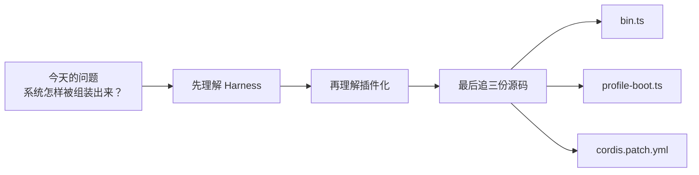
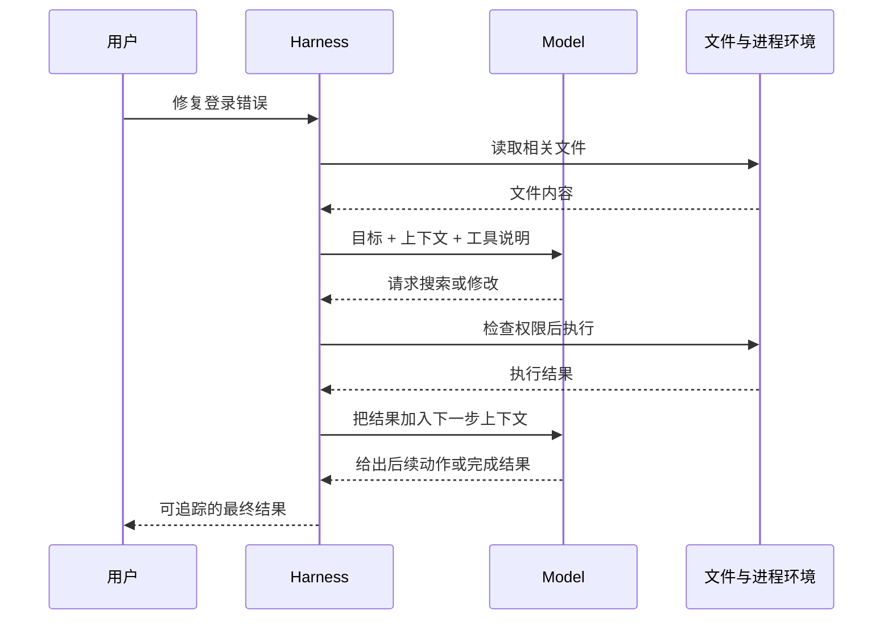
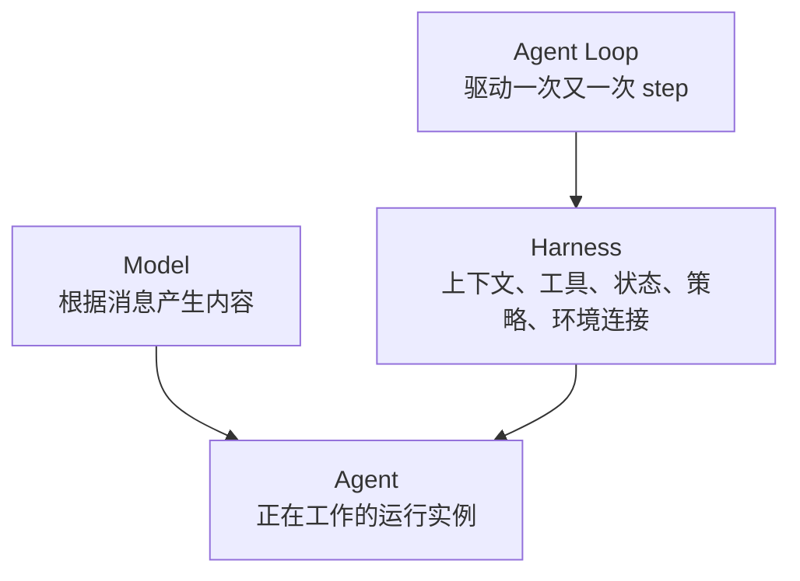
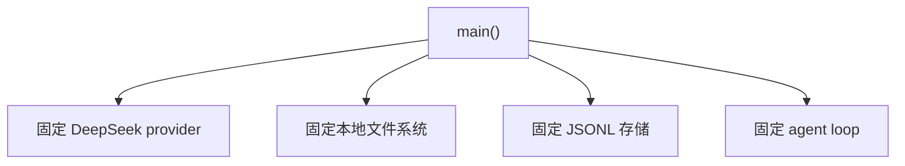
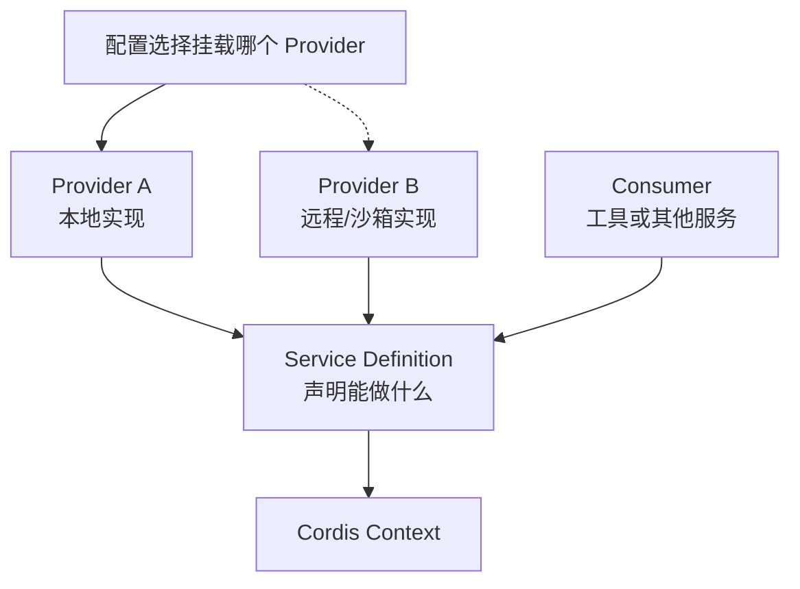
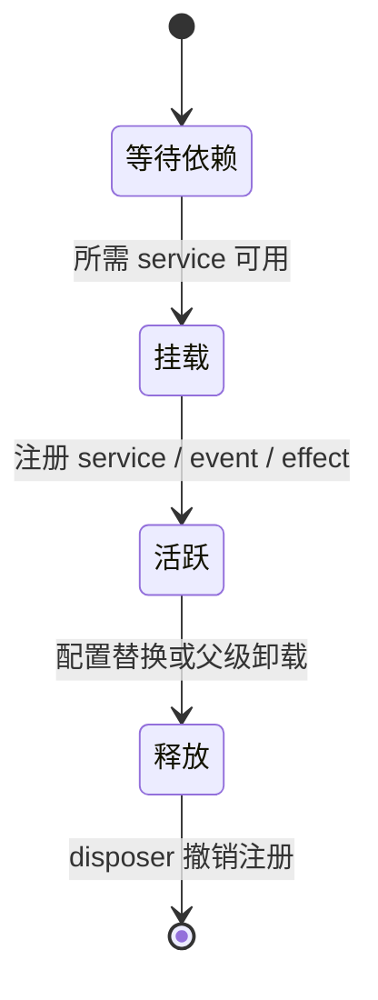
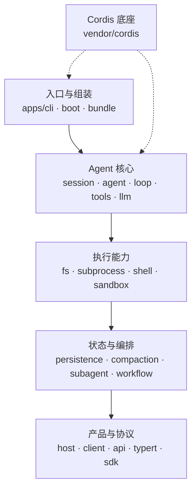
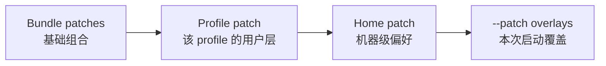
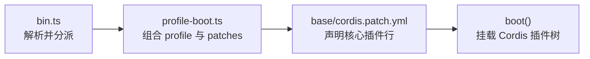
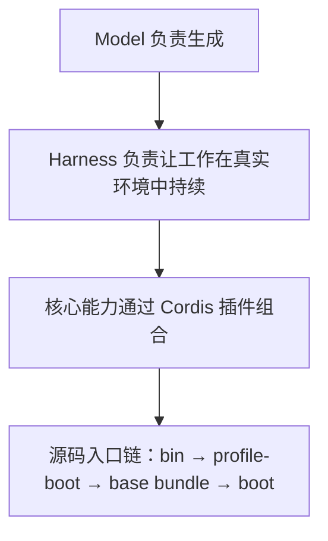

# 第 1 次逐步讲解：从“模型只能输出内容”走到插件树

> 这是本次学习的主教材。  
> 阅读方式：严格按顺序；看到“暂停一下”时先回答，再继续。  
> 源码目录：`D:\code\deepseek-harness\source\deepseek-harness`  
> 本文对应提交：`cd5ef8148158c3a752a658978873241fdf8e2bbc`

## 开始前：我们只追一个问题

大型仓库最容易让初学者迷路，因为每个新文件都会引出更多文件。今天只追一个问题：

> 当用户把一个任务交给 DeepSeek Harness 时，项目怎样从一个命令行入口组装出可以工作的 Agent 系统？

今天不会追到模型真的返回内容，也不会分析 UI。只要能从入口走到插件树，我们就有了后续课程共同使用的地图。



---

## 第 1 步：先想象一个只有模型、没有 Harness 的系统

假设你对一个大语言模型说：“请修复这个仓库中的登录错误。”模型可以生成一段分析，也可能生成建议代码。但是，仅有模型时还缺少很多条件：

- 谁把仓库文件读给模型？
- 谁告诉模型有哪些可调用工具？
- 谁把模型提出的文件修改真正写入磁盘？
- 谁判断某个命令能否执行，是否需要人工批准？
- 谁保存之前发生的消息、工具调用和结果？
- 如果模型调用工具后还要继续思考，谁发起下一次模型请求？

这些都不是“预测下一段文字”本身。它们属于模型周围的运行系统，也就是 harness。

### 图：同一个任务中的两种职责



图中 Model 只负责根据输入产生输出。Harness 负责收集输入、连接环境、执行动作、记录过程并决定是否继续。

### 暂停一下

不要看后文，用一句话回答：如果模型已经很聪明，为什么还需要 Harness？

```text
我的回答：
```

合格答案至少要出现两个词：**真实环境**和**持续状态**。模型聪明并不能自动获得文件、进程、权限和可恢复的任务状态。

---

## 第 2 步：把 Model、Harness、Agent 和 agent loop 分开

这四个词是以后最常出现的词。先用职责定义，而不是用模糊的“AI 系统”概括它们。



可以先采用下面的心智模型：

- Model 是一种能力：给它一组消息，它产生流式内容或工具调用意图。
- Harness 是运行时和组装方式：决定模型看到什么、能做什么、怎样记录以及怎样继续。
- Agent 是一个正在工作的对象：它有输入、状态、生命周期和属于自己的上下文。
- Agent loop 是 Harness 中的一个组件：它领取输入、发起请求、处理工具结果，并判断是否继续下一 step。

为什么必须单独区分 agent loop？因为 DeepSeek Harness 明确把默认 loop 也做成插件。以后添加行为时，项目希望你优先使用既有服务或事件扩展点，而不是把所有功能塞进 loop。

### 暂停一下

判断下面说法是否准确，并写出理由：

> DeepSeek Harness 就是一个负责反复调用大模型的循环。

```text
我的判断：
我的理由：
```

这句话不准确。循环很重要，但它依赖 Session、System Prompt、Tools、LLM、权限和各种执行能力；完整 Harness 还负责组合、持久化、产品协议和生命周期。

---

## 第 3 步：为什么核心本身也要做成插件

先看一种“全部写死在主函数里”的设计。



这种设计在功能很少时直观，但替换一项能力往往要修改主程序。比如把本地文件系统换成远程沙箱时，Shell、终端和 LSP 可能也要跟着改变；如果各消费方直接依赖具体类，替换成本会快速增加。

DeepSeek Harness 采用另一种思路：模块向共享 Context 提供服务或监听事件，消费方依赖稳定能力，而不是绑定某个具体 provider。



这就是“Everything is a Plugin”的核心含义：不仅外围功能可插拔，Session、Tools、LLM 和 agent loop 等内部能力也通过同一套插件与服务机制组合。

这里先不要把 Service Definition、Provider、Consumer 背成抽象名词。只记住一个问题：**消费方需要的是某项能力，还是某个具体实现？** 插件架构希望答案尽量是前者。

### 暂停一下

如果以后要把文件操作从本机换成远程沙箱，理想情况下哪些代码应该变化？

```text
我的回答：
```

理想情况是更换或重新配置 provider；依赖文件能力的工具继续面向同一个 Service Definition。真实项目还要考虑 Shell、子进程和工作目录是否共享同一执行世界，这会在第 15 次详细学习。

---

## 第 4 步：Cordis Context 不是普通的全局对象

初看 `ctx.tools`、`ctx.llm`、`ctx.sessions` 时，很容易把 Context 理解成一个装满单例的全局变量。这个理解不够完整，因为 Cordis 还管理依赖激活、插件 Fiber 和可撤销 effect。

今天只建立最小模型：



一个插件可能声明自己需要哪些 service。依赖满足时，Cordis 挂载插件；插件通过 Context 注册能力和事件；插件卸载时，Cordis 按生命周期撤销它拥有的 effect。

这解释了为什么配置文件中的上下顺序不必等于运行时加载顺序。base bundle 自己的注释写明，行顺序用于帮助读者分组，激活由服务可用性驱动。

### 暂停一下

为什么“插件被卸载”不能只意味着“不再调用它的新函数”？

```text
我的回答：
```

因为插件可能已经注册服务、事件监听器、计时器或其他资源。如果不撤销，旧插件即使看似卸载，仍会影响新请求或持有资源。第 6 次会进入 Fiber 和 effect 源码验证这一点。

---

## 第 5 步：面对 254 个 package，先按问题分层

当前快照中，`packages/` 有 51 个一级领域分组和 254 个 `package.json`。数字会变化，但它说明一个事实：不能把“读完整个仓库”当作一个可执行任务。

我们先用五层学习地图降低复杂度。



这不是说真实依赖永远从上往下。它只回答“我正在看的代码主要属于哪类问题”。

今天的问题是“系统怎样被组装出来”，所以只看第一层的三个入口：

1. `apps/cli/src/bin.ts`：进程入口怎样分派？
2. `apps/cli/src/profile-boot.ts`：profile 怎样被组合和启动？
3. `packages/bundle/base/cordis.patch.yml`：核心插件行来自哪里？

### 暂停一下

如果问题改成“工具执行前在哪里做策略检查”，你还应该继续深挖 CLI 吗？

```text
我的回答：
```

不应该。CLI 只证明系统如何开始。工具执行属于 `packages/core/tools/` 和 interaction/policy 相关模块，将在第 14 次沿另一条纵向路径追踪。

---

## 第 6 步：逐行读懂第一个入口 `bin.ts`

先打开 [`apps/cli/src/bin.ts`](https://github.com/deepseek-ai/deepseek-harness/blob/cd5ef8148158c3a752a658978873241fdf8e2bbc/apps/cli/src/bin.ts)。这个文件很短，适合作为第一次源码阅读对象。

### 6.1 输入来自哪里

```ts
const invocation = parseDshArgs(process.argv.slice(2), readVersion())
```

逐段翻译：

- `process.argv` 是进程收到的参数数组。
- `slice(2)` 去掉 Node 可执行文件和脚本入口，只保留用户参数。
- `readVersion()` 从 CLI 自己的 `package.json` 读取版本。
- `parseDshArgs(...)` 把原始字符串解释为结构化的 `invocation`。

此时不要猜 invocation 的全部字段。接着看谁读取了它。

### 6.2 判别字段决定分支

```ts
switch (invocation.mode) {
  case 'profile':
  case 'plugin':
  case 'dump-config':
}
```

`mode` 是判别字段。不同 mode 对应不同结构和处理路径：启动 profile、管理插件或打印配置。

这类 `switch` 在 TypeScript 项目中非常常见。第 2 次会解释判别联合类型；今天只需要知道它让入口显式列出所有运行模式。

### 6.3 profile 分支把责任交出去

```ts
const { runProfile } = await import('./profile-boot.ts')
await runProfile({
  environment: loadLayeredEnv('dsh'),
  profile: invocation.profile,
  patchFiles: invocation.patches,
  args: invocation.args,
})
```

`bin.ts` 没有自己创建 Session、LLM 或 Tools。它把四类输入交给 `runProfile()`：环境快照、profile 名、额外 patch 文件和应用参数。

这就是第一次职责切分：**入口负责解析和分派，profile-boot 负责组装与启动。**

### 暂停一下

请不看上面的代码，写出 `runProfile()` 接收的四类信息：

```text
1.
2.
3.
4.
```

---

## 第 7 步：在 `profile-boot.ts` 中只抓三根主线

[`apps/cli/src/profile-boot.ts`](https://github.com/deepseek-ai/deepseek-harness/blob/cd5ef8148158c3a752a658978873241fdf8e2bbc/apps/cli/src/profile-boot.ts) 比 `bin.ts` 长得多。不要从第一行开始理解每个 helper。先搜索三个符号：`composeProfile`、`allPatches`、`boot`。

```powershell
Select-String -Path .\apps\cli\src\profile-boot.ts -Pattern '^async function composeProfile','allPatches','await boot'
```

### 7.1 `composeProfile()` 收集层

从当前实现可以观察到几类来源：

- profile 自己声明的 bundle layers；
- profile 的用户 patch；
- Harness home 级 patch；
- 命令行 `--patch` overlays；
- 遥测关闭开关生成的覆盖。

不需要现在记住所有层。先记住：最终配置不是单个 YAML，而是按优先级叠加的多层结果。

### 7.2 `allPatches()` 固定应用顺序

这个小函数把 `bundlePatches`、profile patches、home patches 和 overlays 依次展开为一个数组。它把“谁覆盖谁”从描述变成了可执行顺序。



后面的层可以覆盖前面的目标行。注意，这里说的是 patch 应用优先级，不是所有插件的运行时激活顺序。

### 7.3 `boot()` 真正挂载配置树

`runProfile()` 最终把空根配置、组合后的 patches 和 host setup 交给 `boot(...)`。这一步才进入 Cordis Loader 与 Context 的实际挂载过程。

今天在这里停下。继续追 `boot()` 会引入 Loader、Fiber、Context 和 fail-loud 生命周期，属于第 6–9 次课程。知道边界在哪里，比第一天强行读完更重要。

### 暂停一下

请区分下面两个顺序：

```text
Patch 应用顺序：
插件激活顺序：
```

参考方向：前者由 `allPatches()` 等组合逻辑表达；后者受服务依赖和 Cordis 生命周期驱动，不能只看 YAML 行号。

---

## 第 8 步：在 base bundle 中看到“核心也是插件”

打开 [`packages/bundle/base/cordis.patch.yml`](https://github.com/deepseek-ai/deepseek-harness/blob/cd5ef8148158c3a752a658978873241fdf8e2bbc/packages/bundle/base/cordis.patch.yml)，不要阅读全文。先搜索六个 id：

```powershell
Select-String -Path .\packages\bundle\base\cordis.patch.yml -Pattern 'id: llm$','id: session$','id: agent$','id: tools$','id: system-prompt$','id: agent-loop$'
```

当前快照中可以找到：

| id | 当前快照行号 | 它先让我们知道什么 |
|---|---:|---|
| `llm` | 27 | LLM capability 由配置行挂载 |
| `session` | 33 | Session 服务也是插件 |
| `agent` | 67 | Agent 注册与生命周期来自独立插件 |
| `tools` | 474 | 工具注册和执行管线独立存在 |
| `system-prompt` | 479 | 提示词组装不是 loop 内部硬编码 |
| `agent-loop` | 486 | 默认循环本身是组合项 |

这些行提供的是**组合证据**。它们证明 base bundle 声明插入相应插件，但还不能单独证明每个插件的全部运行语义。


### 暂停一下

看到 `id: agent-loop` 后，下面哪种结论可以确认？

A. agent loop 一定在 YAML 第 486 行对应的时刻最后启动。  
B. base bundle 声明插入一个 id 为 `agent-loop` 的插件行。  
C. agent loop 内部算法已经完全理解。

正确答案是 B。A 混淆了文件顺序和激活顺序，C 超出了证据范围。

---

## 第 9 步：把三个文件拼成一个有证据的结论

现在把观察连接起来：



我们可以写出一个强度合适的结论：

> `dsh` 的 CLI 入口根据参数选择 profile 启动路径；`profile-boot.ts` 收集 bundle、profile、home 和命令行覆盖层；base-backed profile 通过 base bundle 声明 Session、LLM、Agent、Tools、System Prompt 和默认 Agent Loop 等核心插件；组合结果交给 `boot()` 挂载为 Cordis 插件树。

为什么说这个结论“强度合适”？

- 它没有声称我们已经理解 `boot()` 内部。
- 它没有用 YAML 行顺序推断激活顺序。
- 它区分了入口、组装、配置声明和实际挂载。
- 每一部分都能指向当前源码中的具体文件或函数。

### 证据表

| 结论片段 | 证据 |
|---|---|
| CLI 按 invocation mode 分派 | `apps/cli/src/bin.ts` 的 `switch` |
| profile 路径进入 `runProfile()` | `bin.ts` 的 `case 'profile'` |
| patches 分层组合 | `profile-boot.ts` 的 `composeProfile()` 与 `allPatches()` |
| 核心模块由 base bundle 声明 | `packages/bundle/base/cordis.patch.yml` |
| 组合结果进入 Cordis 启动 | `runProfile()` 对 `boot(...)` 的调用 |

---

## 第 10 步：以后怎样读一个陌生 package

今天只追了入口链。后续进入任何 package 时，固定使用下面的顺序：


例如以后研究 Session，不要先遍历 `packages/core/session/src`。先问“哪些信息必须成为持久事件”；再看 manifest、README、公开类型、追加事件的实现、相关测试和 base bundle 中的挂载行。

这种方法有两个好处：

1. 你始终知道正在回答什么问题。
2. 你能区分作者声明的职责、真实实现、产品组合和可观察行为。

---

## 最后复述：你今天真正学到了什么

请合上源码，用自己的话完成三句话：

```text
1. DeepSeek Harness 解决的问题是：
2. 它最重要的架构思想是：
3. 第一次追源码时，我会从______开始，然后到______，最后看______。
```

如果第 1 句只写“调用大模型”，请重看第 1–2 步。如果第 2 句只写“支持插件”，请补充“核心能力本身也由插件组合”。如果第 3 句列出很多目录，请收窄到今天的三个文件。

## 本讲解的最小结论



下一步不要立刻读更多源码。先进入 [03-练习与答案.md](03-练习与答案.md) 完成题目部分，确认这些关系已经成为你自己的理解。
