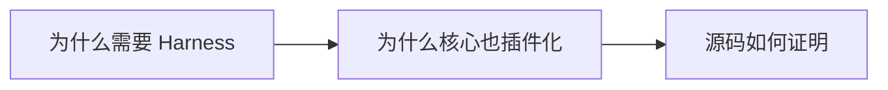
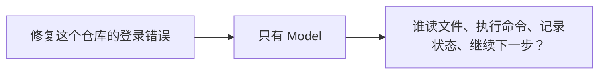
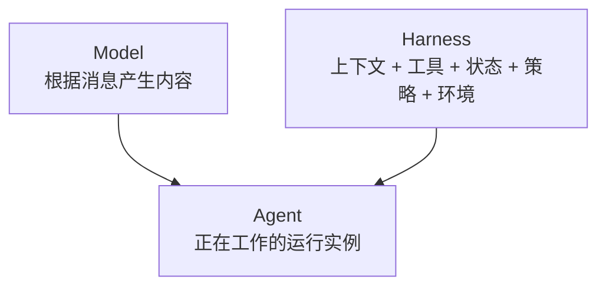
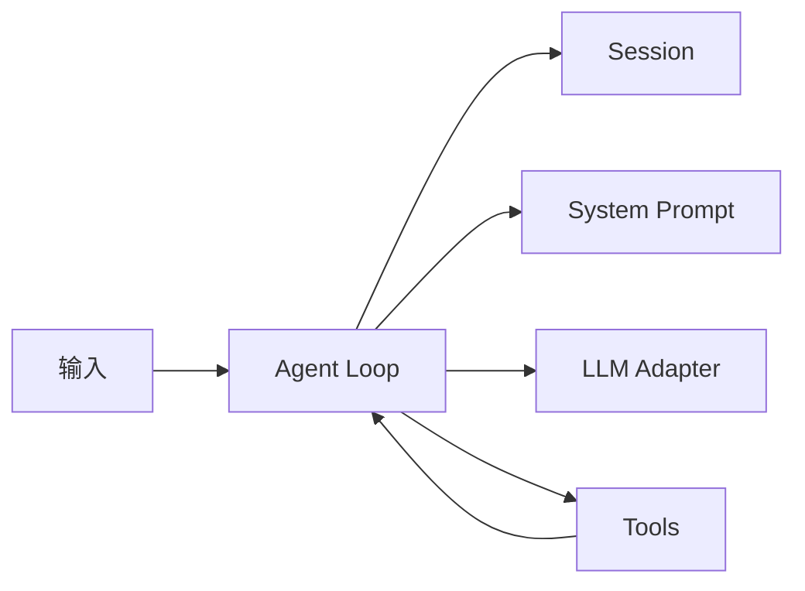
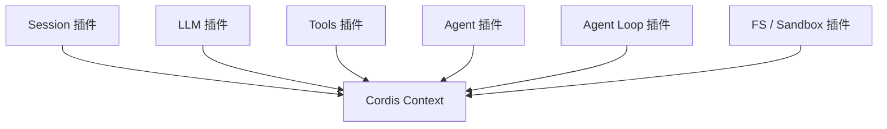
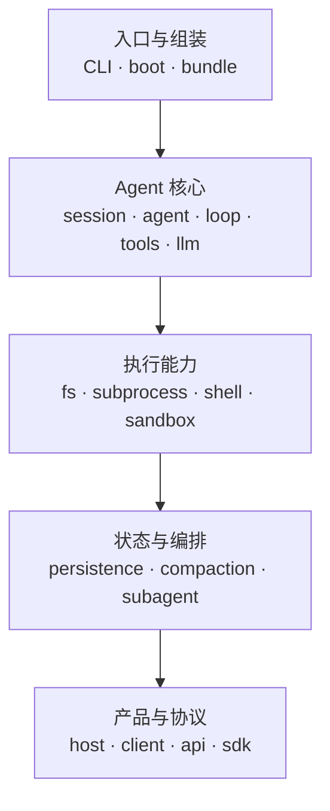
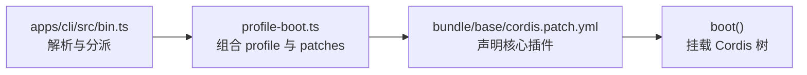
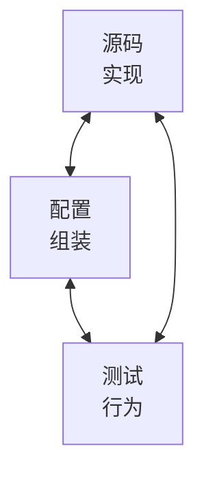
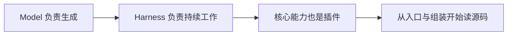

# 第 1 次分享稿：DeepSeek Harness 不只是“调用模型的循环”

> 建议分享时长：10–15 分钟  
> 建议听众：了解大模型或软件开发，但未读过 DeepSeek Harness 源码的同事  
> 分享目标：让听众理解 Harness 的职责、“一切皆插件”的含义，以及一条可验证的源码入口链  
> 源码快照：`cd5ef8148158c3a752a658978873241fdf8e2bbc`

## 1. 分享策略

第一次分享不应该试图介绍全部 254 个 package。听众只需要带走三个结论：

1. Model 负责生成，Harness 负责让工作在真实环境中持续发生。
2. DeepSeek Harness 不只支持外围插件，Session、Tools、LLM 和 Agent Loop 等核心本身也是插件。
3. 从源码可以沿 `bin.ts → profile-boot.ts → base bundle → boot()` 验证应用怎样被组装。



不要在第一次分享中详细讲 Cordis 事件模式、SessionEventMap、工具审批实现或前端协议。有人追问时说明这些是后续纵向主题，比在主线中浅尝辄止更清楚。

## 2. 时间安排

| 时间 | 内容 | 目标 |
|---:|---|---|
| 0:00–1:00 | 开场问题 | 让听众意识到模型之外还有大量运行时职责 |
| 1:00–3:00 | Model、Harness、Agent | 建立统一词汇 |
| 3:00–6:00 | Everything is a Plugin | 解释核心插件化与 Cordis Context |
| 6:00–8:00 | 五层源码地图 | 说明大型 monorepo 怎样读 |
| 8:00–11:00 | CLI 到插件树 | 用真实源码给出证据 |
| 11:00–12:00 | 三点总结 | 强化听众记忆 |
| 12:00–15:00 | 问答或演示余量 | 根据现场情况选择 |

如果只有 8 分钟，删除五层地图的细节和现场演示，保留开场、两个核心概念、源码链和总结。

---

## 第 1 页：标题与开场问题

### 页面上展示

> **DeepSeek Harness 不只是“调用模型的循环”**  
> 从 Model、Plugin 到第一条源码调用链



### 可以直接照着讲

“大家好，我这周开始读 DeepSeek Harness 的源码。最开始我以为它的核心就是反复调用大模型，但读完入口和组装代码后，我发现这个理解太窄。今天我只回答一个问题：模型只负责生成内容，那么谁让它真正进入文件、进程和多步骤任务？答案就是 Harness。接下来我会用三个源码文件证明 DeepSeek Harness 怎样把这些能力组装起来。”

### 本页不要展开

不要讨论模型效果、价格、安装步骤和 Web UI。这些内容不能帮助听众理解本次源码结论。

---

## 第 2 页：Model、Harness、Agent 的分工

### 页面上展示



### 可以直接照着讲

“Model 的职责是根据输入消息产生内容，可能是文本，也可能是工具调用意图。Harness 负责给模型准备上下文、声明和执行工具、维护任务状态、处理权限，并把工具结果送进下一步。Agent 可以理解成 Model 与 Harness 形成的一个运行实例。所以模型更聪明，不等于文件访问、进程执行、状态恢复和权限控制会自动出现。”

### 一句互动

问听众：“如果模型输出‘请执行删除命令’，真正决定是否执行的人是谁？”

期望听到：宿主或 Harness 的工具、权限和审批系统，而不是模型自己。

---

## 第 3 页：Agent Loop 只是 Harness 的一部分

### 页面上展示



### 可以直接照着讲

“Agent Loop 负责把输入推进成一个或多个 step：组装请求、调用模型、处理工具结果，并决定是否继续。但它依赖 Session、System Prompt、LLM 和 Tools。DeepSeek Harness 还有持久化、沙箱、SDK 和产品协议。因此，把整个项目概括成‘调用模型的循环’会丢掉大部分架构。”

### 强调一句

“更特别的是，默认 Agent Loop 自己也是一个插件，不是不可替换的硬编码核心。”

---

## 第 4 页：Everything is a Plugin

### 页面上展示



### 可以直接照着讲

“这里的 plugin 不只指第三方扩展。内置的 Session、LLM、Tools、Agent 和 Agent Loop 都通过 Cordis 挂载到共享 Context。插件可以提供服务、监听事件，并注册由生命周期管理的 effect。消费方尽量依赖稳定能力，而不是具体实现，所以更换 provider 或插入策略不一定要修改 Agent Loop。”

### 用一个例子解释

“比如文件能力可以有本地 provider，也可以有远程或沙箱 provider。工具面对的是文件能力接口；组合配置决定实际挂载哪个实现。”

### 需要保留的限制

不要说“换一行配置就能替换任何东西”。真实替换还受 provider 完整性、共享执行世界、配置和依赖约束。今天只解释架构方向。

---

## 第 5 页：大型仓库不要顺序读

### 页面上展示



### 可以直接照着讲

“当前快照的 `packages/` 有 51 个一级分组和 254 个 package manifest。顺序遍历目录不会形成理解。我采用的办法是先按问题分层：如果问题是‘应用怎样组装’，只看 CLI、boot 和 bundle；如果问题是‘工具怎样执行’，再转向 Tools 和 Interaction。学习单位应该是一个问题，而不是一个目录。”

### 本页结论

“读大型架构仓库时，先找问题所有者，再纵向追配置、源码和测试。”

---

## 第 6 页：第一条真实源码链

### 页面上展示



### 可以直接照着讲

“现在看源码证据。`bin.ts` 调用 `parseDshArgs()`，再根据 `invocation.mode` 分派。profile 模式动态导入 `profile-boot.ts` 并调用 `runProfile()`。`profile-boot.ts` 中的 `composeProfile()` 收集 bundle、profile、home 和命令行 overlay，`allPatches()` 固定覆盖顺序，最后 `runProfile()` 调用 `boot()`。base bundle 的 YAML 则声明插入 LLM、Session、Agent、Tools、System Prompt 和 Agent Loop 等核心插件。”

### 证据位置

| 文件 | 当前快照中的观察 |
|---|---|
| `apps/cli/src/bin.ts` | 第 24 行解析；第 26–46 行分派 |
| `apps/cli/src/profile-boot.ts` | 第 156 行起组合；第 209 行起启动；第 251 行调用 `boot()` |
| `packages/bundle/base/cordis.patch.yml` | `llm`、`session`、`agent`、`tools`、`system-prompt`、`agent-loop` 均为配置行 |

---

## 第 7 页：证据能说明什么，也要说明不能说明什么

### 页面上展示



### 可以直接照着讲

“YAML 中出现 `id: agent-loop`，能证明 base bundle 声明插入这个插件行，但不能证明它按文件位置最后激活，也不能证明我们已经理解内部算法。可靠的源码分析要区分实现证据、组合证据和行为证据。今天我只建立入口与组合结论，Cordis 生命周期和 Agent Loop 算法会继续向下追。”

### 这页体现你的学习质量

分享时主动说明结论边界，会比讲更多 package 名更有说服力。

---

## 第 8 页：结束总结

### 页面上展示



### 可以直接照着讲

“最后总结三点。第一，Model 负责生成，Harness 负责上下文、工具、状态、策略和真实环境。第二，DeepSeek Harness 的特殊之处不是外围支持插件，而是核心能力本身也由 Cordis 插件组合。第三，第一次读源码可以从 `bin.ts`、`profile-boot.ts` 和 base bundle 建立入口链，不要一开始遍历所有 package。我的下一步是补 TypeScript 阅读基础，再进入 Cordis 生命周期。”

### 结束问题

“如果大家只能记住一句，我希望是：Agent Loop 很重要，但 Harness 远不止一个循环。”

---

## 3. 两分钟源码演示

如果现场允许展示编辑器或终端，演示下面三步。不要启动产品，也不要临时进入陌生文件。

### 演示 1：CLI 分派

```powershell
Set-Location D:\code\deepseek-harness\source\deepseek-harness
Select-String -Path .\apps\cli\src\bin.ts -Pattern 'parseDshArgs','runProfile','runPlugin','runDumpConfig'
```

讲解：“入口只做解析和分派，profile 模式把责任交给 `runProfile()`。”

### 演示 2：profile 组装与启动

```powershell
Select-String -Path .\apps\cli\src\profile-boot.ts -Pattern '^async function composeProfile','^export async function runProfile','await boot','allPatches'
```

讲解：“这里能定位组合函数、启动函数和最终 `boot()` 调用，不需要现场滚动几百行代码。”

### 演示 3：核心也是插件

```powershell
Select-String -Path .\packages\bundle\base\cordis.patch.yml -Pattern 'id: llm$','id: session$','id: agent$','id: tools$','id: system-prompt$','id: agent-loop$'
```

讲解：“这些核心角色由 base bundle 声明为插件行，这就是 Everything is a Plugin 的直接组合证据。”

### 演示失败时的备用方案

如果路径、终端字体或源码提交不同，直接展示第 6 页的调用链图，并说明你的材料基于提交 `cd5ef81`。不要在分享现场修环境。

---

## 4. 可能被问到的问题

### 问：这和“支持插件的普通应用”有什么不同？

答：本次源码中，插件机制不只位于外围；Session、LLM、Tools、Agent 和默认 Agent Loop 等核心能力也通过 Cordis Context 组合。具体差异还需要针对另一个项目做同层比较，本次不做宽泛优劣结论。

### 问：Agent Loop 是不是最核心、最值得先读？

答：它是关键驱动，但依赖 Session、System Prompt、LLM 和 Tools 的服务与事件。如果不了解这些所有权，直接读 loop 容易把别人的职责误认为 loop 本身，因此课程先建立组装和 Cordis 基础。

### 问：YAML 中排在后面的插件是不是后启动？

答：不能这样推断。base bundle 的注释说明行顺序主要用于阅读分组，Cordis 的激活受 service availability 和生命周期驱动。Patch 覆盖顺序与插件激活顺序是两件事。

### 问：插件化是不是一定更简单？

答：不一定。它降低具体实现耦合并支持替换，但同时引入配置组合、依赖激活和生命周期理解成本。判断好坏要看扩展与替换需求，不能只看抽象数量。

### 问：看到 `id: tools` 是否说明工具执行是安全的？

答：不是。它只说明工具服务被组合。实际安全还取决于 schema 验证、执行 pipeline、策略、审批、sandbox 和 provider；这些属于后续源码主题。

### 问：为什么不直接介绍 Web UI 怎么用？

答：这次的目标是理解源码和原理。UI 操作可以帮助验证结果，但不能替代对入口、组合和核心职责的理解。

### 问：254 个 package 都需要学习吗？

答：不需要逐个学习。应该从机制问题出发，选择相关 Definition、Provider、Consumer、配置和测试进行纵向阅读。

---

## 5. 分享前检查表

- [ ] 我能在 30 秒内说清本次只讲哪三个结论。
- [ ] 我没有把 Model、Agent、Harness 和 Agent Loop 混用。
- [ ] 我能解释为什么核心模块也算插件。
- [ ] 我能在 2 分钟内完成三条源码定位命令。
- [ ] 我不会把 YAML 行顺序说成插件启动顺序。
- [ ] 我能主动说明本次结论基于提交 `cd5ef81`。
- [ ] 我至少进行了一次计时试讲。
- [ ] 我的分享在 12 分钟左右结束，为问答留出时间。

## 6. 一页分享摘要

如果团队需要会后材料，可以直接复制下面这段：

> DeepSeek Harness 是把大语言模型接入上下文、工具、状态、权限和真实环境的 Agent Harness。Model 负责产生内容，Harness 负责让多步骤工作可执行、可记录并可继续；Agent Loop 只是其中的驱动组件。项目基于 Cordis 采用 “Everything is a Plugin” 架构，Session、LLM、Tools、Agent 和默认 Agent Loop 等核心能力也通过插件树组合。源码入口可以从 `apps/cli/src/bin.ts` 追到 `profile-boot.ts`，再到 `packages/bundle/base/cordis.patch.yml` 和 `boot()`；这条路径证明 CLI 选择 profile，多层 patch 组成应用，而核心能力不是在一个主函数中硬编码创建。以上结论基于源码提交 `cd5ef81`。

